# GPSRCS Protocol — Comprehensive Technical Report

**Author:** EL-GHOUCHMA DRISS  
**Protocol:** GPSRCS — GPSR Baseline with post-hoc Secrecy Capacity measurement  
**File analysed:** `GPSRCS.cc` / `GPSRCS.h`  
**Framework:** INET 4.x / OMNeT++ 6.x  
**Package:** `vanetsim.routing.gpsrCS`  
**Date:** 2026-07-01

---

## Protocol Design Intent

GPSRCS is the **baseline comparator** against UFRPLS. Its routing decisions are made using **pure distance** (standard GPSR greedy + perimeter fallback). After each hop selection, the Secrecy Capacity CS is computed **post-hoc** as a passive observer metric — it has **zero influence** on which neighbour is chosen. This design deliberately isolates the security benefit of UFRPLS's utility function by using an otherwise-identical simulation stack.

```
Routing decision:  distance only (standard GPSR)
PLS measurement:   CS = max(Cij − Cie, 0)  — recorded, not used
Communication range: R = 200 m  (Chai Table 2)
```

---

## Table of Contents

1. [Static Module-Level Elements](#1-static-module-level-elements)
2. [Constructor / Destructor](#2-constructor--destructor)
3. [initialize()](#3-initialize)
4. [handleMessageWhenUp()](#4-handlemessagewhenup)
5. [processSelfMessage()](#5-processselfmessage)
6. [processMessage()](#6-processmessage)
7. [scheduleBeaconTimer()](#7-schedulebeacontimer)
8. [processBeaconTimer()](#8-processbeacontimer)
9. [schedulePurgeNeighborsTimer()](#9-schedulepurgeneighborstimer)
10. [processPurgeNeighborsTimer()](#10-processpurgeneighborstimer)
11. [sendUdpPacket()](#11-sendudppacket)
12. [processUdpPacket()](#12-processudppacket)
13. [createBeacon()](#13-createbeacon)
14. [sendBeacon()](#14-sendbeacon)
15. [processBeacon()](#15-processbeacon)
16. [createGPSRCSOption()](#16-creategpsrcsoption)
17. [computeOptionLength()](#17-computeoptionlength)
18. [configureInterfaces()](#18-configureinterfaces)
19. [lookupPositionInGlobalRegistry()](#19-lookuppositioninglobalregistry)
20. [storePositionInGlobalRegistry()](#20-storepositioninglobalregistry)
21. [storeSelfPositionInGlobalRegistry()](#21-storeselfpositioninglobalregistry)
22. [computeIntersectionInsideLineSegments()](#22-computeintersectioninsidelinesegments)
23. [getNeighborPosition()](#23-getneighborposition)
24. [getVectorAngle()](#24-getvectorangle)
25. [getNeighborAngle()](#25-getneighborangle)
26. [getHostName()](#26-gethostname)
27. [getSelfAddress()](#27-getselfaddress)
28. [getSenderNeighborAddress()](#28-getsenderneighboraddress)
29. [getNextNeighborExpiration()](#29-getnextneighborexpiration)
30. [purgeNeighbors()](#30-purgeneighbors)
31. [getPlanarNeighbors()](#31-getplanarneighbors)
32. [getPlanarNeighborsCounterClockwise()](#32-getplanarneighborscounterclockwise)
33. [calculateChannelCapacity()](#33-calculatechannelcapacity)
34. [calculateSecrecyCapacity()](#34-calculatesecrecycapacity)
35. [findNextHop()](#35-findnexthop)
36. [findGreedyRoutingNextHop()](#36-findgreedyroutingnexthop)
37. [findPerimeterRoutingNextHop()](#37-findperimeterroutingnexthop)
38. [routeDatagram()](#38-routedatagram)
39. [setGPSRCSOptionOnNetworkDatagram()](#39-setgpsrcsoptiononnetworkdatagram)
40. [findGPSRCSOptionInNetworkDatagram()](#40-findgpsrcsoptioninnetworkdatagram)
41. [findGPSRCSOptionInNetworkDatagramForUpdate()](#41-findgpsrcsoptioninnetworkdatagramforupdate)
42. [getGPSRCSOptionFromNetworkDatagram()](#42-getgpsrcsoptionformnetworkdatagram)
43. [getGPSRCSOptionFromNetworkDatagramForUpdate()](#43-getgpsrcsoptionformnetworkdatagramforupdate)
44. [datagramPreRoutingHook()](#44-datagrampreroutinghook)
45. [datagramLocalInHook()](#45-datagramlocalinhook)
46. [datagramLocalOutHook()](#46-datagramlocalouthook)
47. [handleStartOperation()](#47-handlestartoperation)
48. [handleStopOperation()](#48-handlestooperation)
49. [handleCrashOperation()](#49-handlecrashoperation)
50. [finish()](#50-finish)
51. [receiveSignal()](#51-receivesignal)

---

## 1. Static Module-Level Elements

### `determinant(a1, a2, b1, b2)` — file-scope static inline

**Role:** Computes the 2×2 matrix determinant `a1*b2 − a2*b1`. Used exclusively by `computeIntersectionInsideLineSegments()`.

**Inputs:** Four doubles forming the matrix entries.  
**Returns:** `double` — the determinant value.  
**Called by:** `computeIntersectionInsideLineSegments()`.

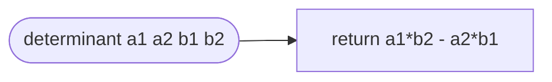

---

### `COMM_RANGE_M = 200.0` — file-scope constexpr

**Role:** Communication range constraint from Chai et al. Table 2. Neighbours farther than 200 m are rejected during next-hop selection in `findGreedyRoutingNextHop()`.

---

### `GPSRCS::globalPositionTable` — static class member

**Role:** Simulation-wide shared registry mapping all node addresses to their most recently broadcast positions (and eavesdropper entries). Shared across all `GPSRCS` module instances; accessed via static member in `lookupPositionInGlobalRegistry()`, `storePositionInGlobalRegistry()`, and `calculateSecrecyCapacity()`.

---

## 2. Constructor / Destructor

### `GPSRCS()`

**Role:** Default constructor; no member initialisation beyond class-level defaults.  
**Called by:** OMNeT++ module instantiation machinery.

### `~GPSRCS()`

**Role:** Destructor. Cancels and deletes both timer messages to prevent memory leaks and dangling scheduled events.

**Inputs:** `beaconTimer`, `purgeNeighborsTimer` (both `cMessage*`).

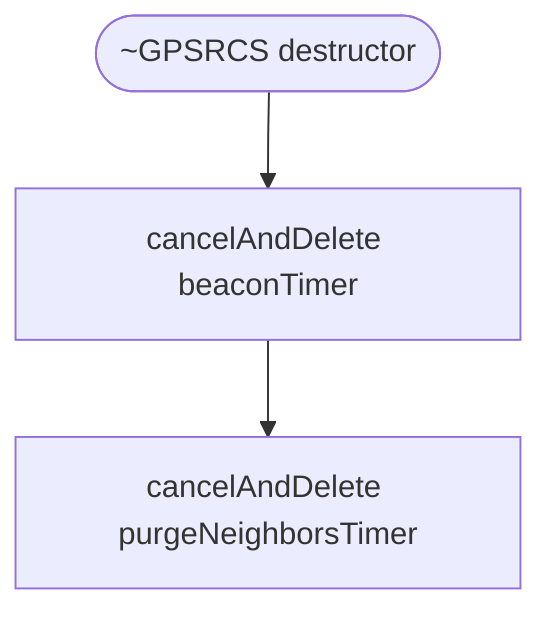

---

## 3. `initialize(int stage)`

**Role:** Two-stage OMNeT++ initialisation. All NED parameter reads, module pointer resolution, timer allocation, and signal registration happen here.

**Inputs:** `stage` — integer init stage index.  
**Member variables written:** All private members.  
**Called by:** OMNeT++ framework, twice per simulation start.

**Stage `INITSTAGE_LOCAL`:**
- Parses `planarizationMode` (empty string → `NO_PLANARIZATION`, `"GG"`, or `"RNG"`)
- Reads `interfaces`, `beaconInterval`, `maxJitter`, `neighborValidityInterval`, `displayBubbles`
- Resolves `host`, `interfaceTable`, `outputInterface`, `mobility`, `routingTable`, `networkProtocol`
- Allocates `beaconTimer` and `purgeNeighborsTimer`
- Reads `positionByteLength`
- Reads PLS channel parameters: `transmitPower`, `noisePower`, `wavelength`
- Initialises `totalHops = 0`, `secureHops = 0`
- Registers signals: `csSignal`, `minCsPerPktSignal`, `delaySignal`
- Clears `globalPositionTable`

**Stage `INITSTAGE_ROUTING_PROTOCOLS`:**
- Sets `addressType` from own address
- Registers MANET service and protocol gates
- Subscribes to `linkBrokenSignal`
- Registers netfilter hook at priority 0
- Enables `WATCH(neighborPositionTable)` for GUI

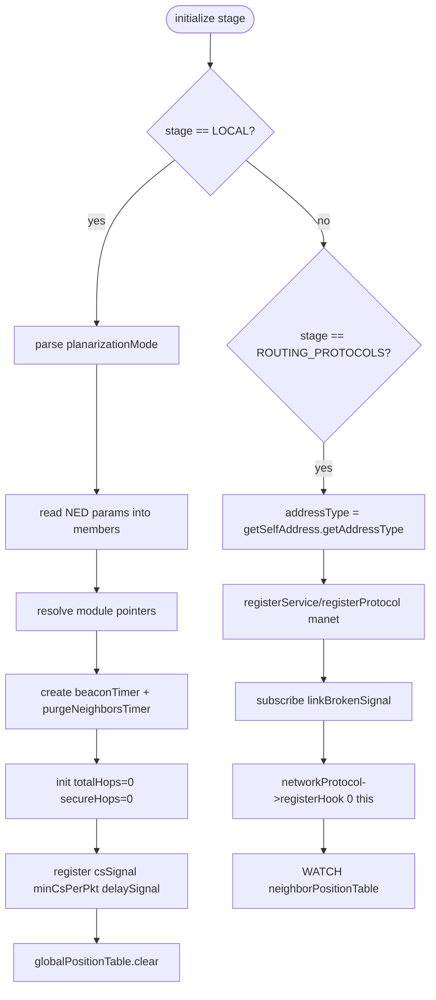

---

## 4. `handleMessageWhenUp(cMessage *message)`

**Role:** Entry point for all messages when the module is running. Dispatches self-messages vs external messages.

**Inputs:** `message` — any incoming `cMessage`.  
**Called by:** OMNeT++ framework on message arrival.

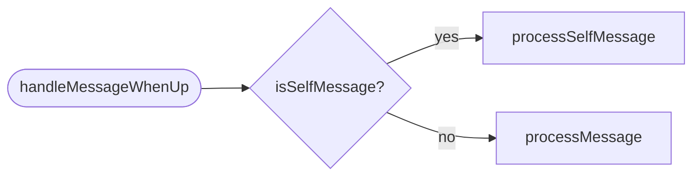

---

## 5. `processSelfMessage(cMessage *message)`

**Role:** Identifies which internal timer fired and dispatches to the correct handler.

**Inputs:** `message` — one of `beaconTimer`, `purgeNeighborsTimer`, or unknown.

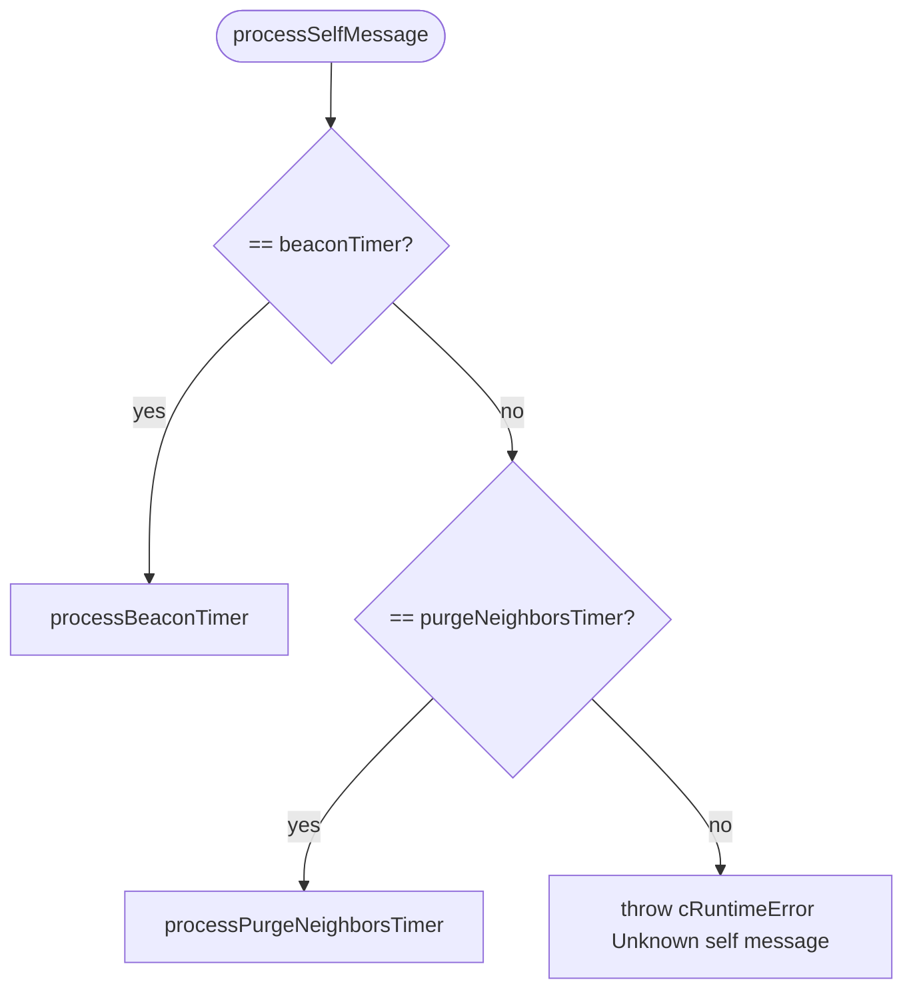

---

## 6. `processMessage(cMessage *message)`

**Role:** Handles external messages. Only `Packet*` (UDP beacons) are expected; any other type throws.

**Inputs:** `message` — expected to be a `Packet*`.

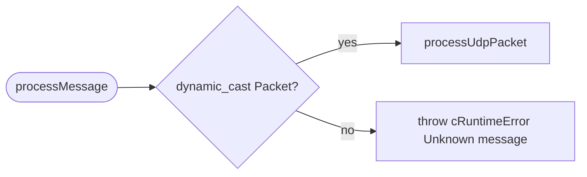

---

## 7. `scheduleBeaconTimer()`

**Role:** Schedules `beaconTimer` to fire at `simTime() + beaconInterval ± random jitter`. The jitter prevents synchronised beacon storms in dense networks.

**Inputs:** `beaconInterval`, `maxJitter`.  
**Called by:** `processBeaconTimer()` (self-reschedule) and `handleStartOperation()`.

```mermaid
flowchart LR
    A([scheduleBeaconTimer]) --> B[t = simTime + beaconInterval + uniform(-1,1)*maxJitter]
    B --> C[scheduleAt t beaconTimer]
```

---

## 8. `processBeaconTimer()`

**Role:** Fires when the beacon timer expires. Creates and broadcasts a beacon, updates the global position registry, then reschedules both the beacon and purge timers.

**Inputs:** Implicit — `getSelfAddress()`, `createBeacon()`, `storeSelfPositionInGlobalRegistry()`.  
**Called by:** `processSelfMessage()` when `message == beaconTimer`.

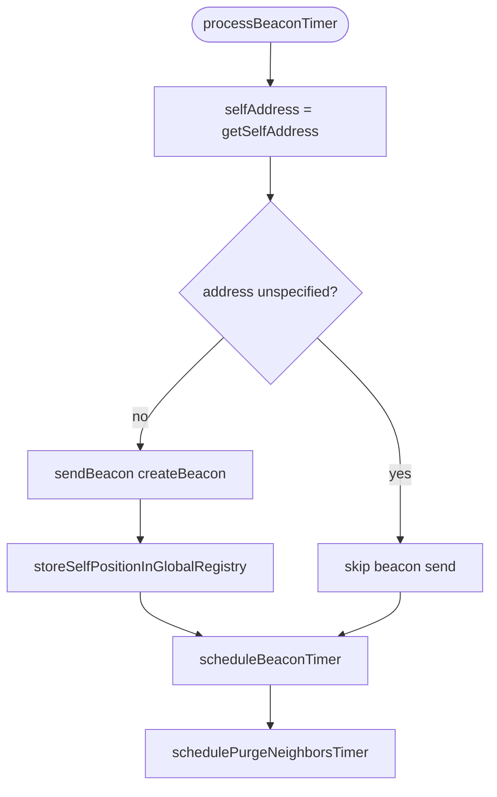

---

## 9. `schedulePurgeNeighborsTimer()`

**Role:** Schedules or reschedules `purgeNeighborsTimer` to fire when the oldest neighbour entry is about to expire. Cancels the timer if the table is empty.

**Inputs:** `getNextNeighborExpiration()` result.  
**Called by:** `processBeaconTimer()` and `processPurgeNeighborsTimer()` and `processUdpPacket()`.

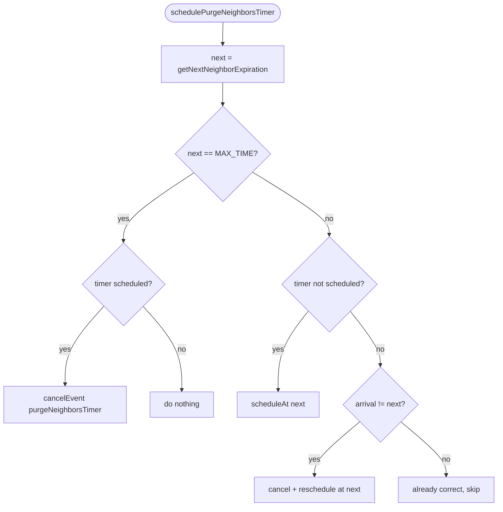

---

## 10. `processPurgeNeighborsTimer()`

**Role:** Purges stale neighbour and eavesdropper entries from the local position table, then reschedules the purge timer.

**Called by:** `processSelfMessage()` when `message == purgeNeighborsTimer`.

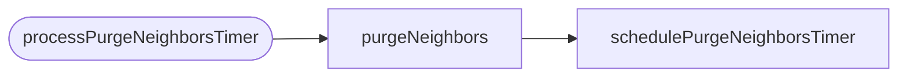

---

## 11. `sendUdpPacket(Packet *packet)`

**Role:** Sends a fully assembled packet out through the `socketOut` gate to the network layer.

**Inputs:** `packet` — ready-to-send UDP packet.  
**Called by:** `sendBeacon()`.

---

## 12. `processUdpPacket(Packet *packet)`

**Role:** Strips the UDP header from an incoming packet and forwards the payload to `processBeacon()`. Reschedules the purge timer afterwards.

**Inputs:** `packet` — raw received UDP packet with UdpHeader.  
**Called by:** `processMessage()`.

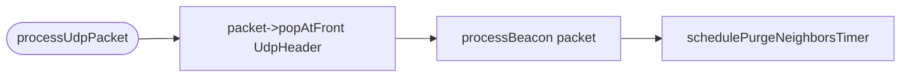

---

## 13. `createBeacon() → Ptr<GPSRCSBeacon>`

**Role:** Allocates and fills a `GPSRCSBeacon` chunk with this node's full mobility state (address, position, velocity, acceleration, angular direction) and the `isEavesdropper` NED parameter flag.

**Inputs (implicit):** `getSelfAddress()`, `mobility->getCurrentPosition/Velocity/Acceleration/AngularPosition()`, `par("isEavesdropper")`, `positionByteLength`.  
**Called by:** `processBeaconTimer()`.

> **Key difference from UFRPLS:** GPSRCS beacons include full kinematic state (velocity, acceleration, direction) because the position table stores these for potential use in perimeter routing and mobility-aware extensions.

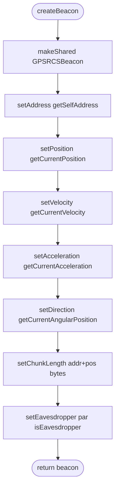

---

## 14. `sendBeacon(const Ptr<GPSRCSBeacon>& beacon)`

**Role:** Wraps the beacon chunk in a UDP packet with port 269, sets MANET multicast destination address, hop limit 255, and dispatches via `sendUdpPacket()`.

**Inputs:** `beacon` — the chunk produced by `createBeacon()`.  
**Called by:** `processBeaconTimer()`.

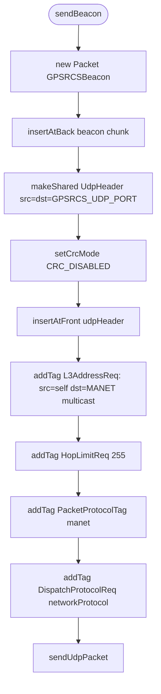

---

## 15. `processBeacon(Packet *packet)`

**Role:** Processes a received `GPSRCSBeacon`. Branches on the `isEavesdropper` flag:
- **Eavesdropper:** Adds to both `neighborPositionTable` and `globalPositionTable` eavesdropper tables.
- **Legitimate:** Updates the neighbour's kinematic state (position, velocity, acceleration, direction) in `neighborPositionTable`.

Deletes the packet after processing.

**Inputs:** `packet` — stripped UDP packet containing a `GPSRCSBeacon`.  
**Called by:** `processUdpPacket()`.

> **Design note:** Eavesdroppers are registered globally so that nodes outside radio range still compute correct CS. Legitimate neighbours receive full kinematic updates enabling potential mobility-prediction extensions.

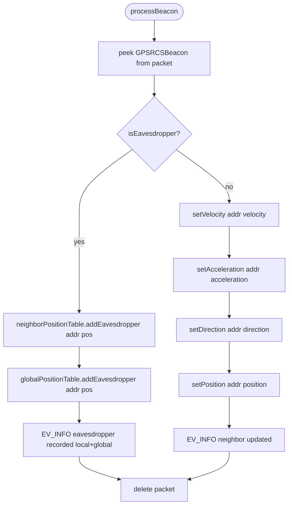

---

## 16. `createGPSRCSOption(L3Address destination) → GPSRCSOption*`

**Role:** Allocates a new `GPSRCSOption` routing header for an outgoing data packet. Sets routing mode to GREEDY, looks up destination position from global registry, and initialises `routeMinCS = 1e300` (sentinel meaning "not yet set").

**Inputs:** `destination` — the final L3 destination address.  
**Called by:** `datagramLocalOutHook()`.

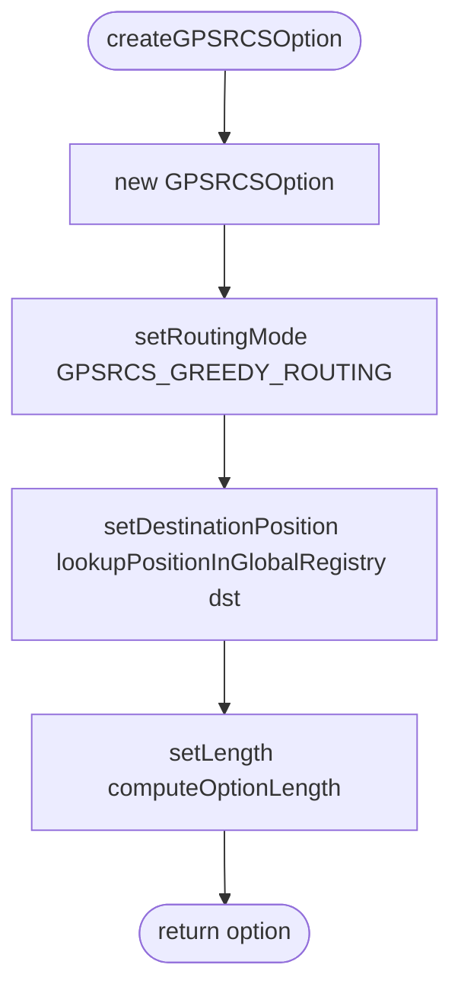

---

## 17. `computeOptionLength(GPSRCSOption *option) → int`

**Role:** Calculates the byte length of the routing option header based on the current address type byte length and position byte length. Result is used to size the option in the network header.

**Formula:**  
`length = 2 (TL) + 1 (mode) + 3 × positionByteLength + 3 × addressByteLength`

**Inputs:** `option` (unused except for type context), `positionByteLength`, address byte length from `getSelfAddress().getAddressType()`.  
**Called by:** `createGPSRCSOption()`.

---

## 18. `configureInterfaces()`

**Role:** Iterates all interfaces matching the `interfaces` NED parameter pattern and joins the MANET multicast group on each multicast-capable interface.

**Inputs:** `interfaces` pattern, `interfaceTable`, `addressType`.  
**Called by:** `handleStartOperation()`.

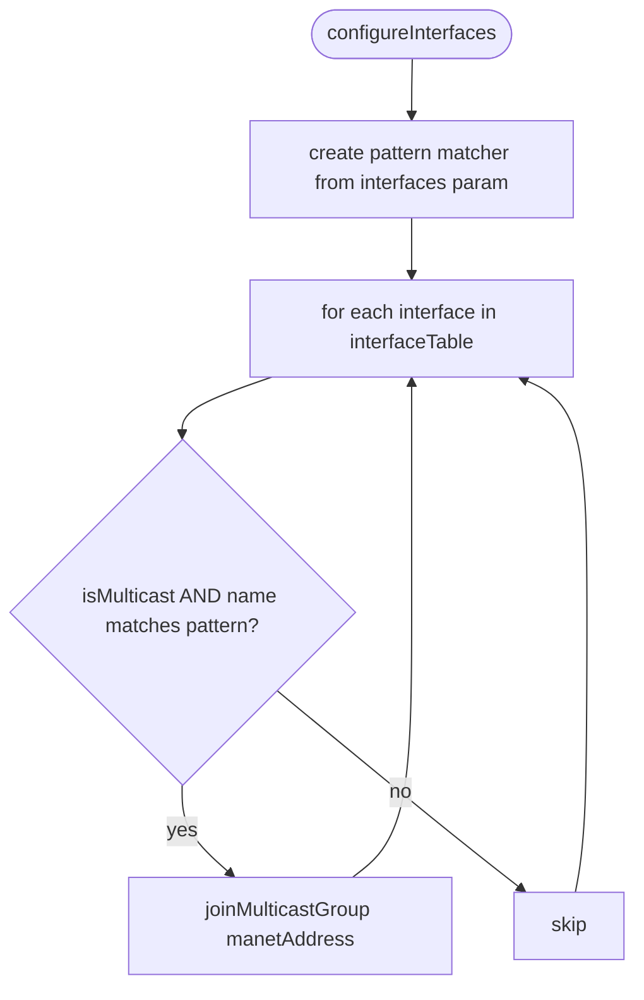

---

## 19. `lookupPositionInGlobalRegistry(address) → Coord`

**Role:** Retrieves a node's last-known position from the simulation-wide `globalPositionTable`.

**Inputs:** `address` — L3Address to look up.  
**Called by:** `createGPSRCSOption()`.

---

## 20. `storePositionInGlobalRegistry(address, position)`

**Role:** Inserts or updates an address→position mapping in the global table.

**Called by:** `storeSelfPositionInGlobalRegistry()`.

---

## 21. `storeSelfPositionInGlobalRegistry()`

**Role:** Convenience wrapper that stores this node's own current position into the global registry under its own address.

**Called by:** `processBeaconTimer()` and `handleStartOperation()`.

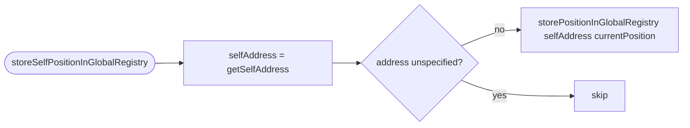

---

## 22. `computeIntersectionInsideLineSegments(begin1, end1, begin2, end2) → Coord`

**Role:** Computes the intersection point of two 2-D line segments using Cramer's rule with the 2×2 determinant helper. Returns `Coord::NIL` if:
- Any endpoint pair coincides (degenerate), or
- The algebraic intersection falls outside at least one segment.

**Inputs:** Four `Coord` references defining the two segments.  
**Returns:** Intersection `Coord`, or `Coord::NIL` (NaN components).  
**Called by:** `findPerimeterRoutingNextHop()` to test whether a candidate edge crosses the line from perimeter-start to destination.

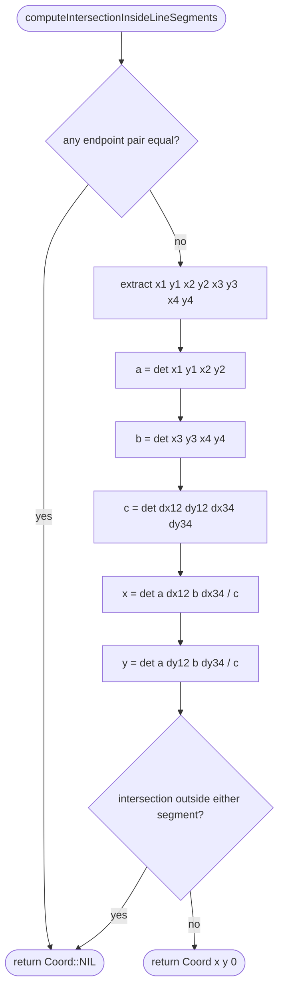

---

## 23. `getNeighborPosition(address) → Coord`

**Role:** Retrieves a neighbour's last-known position from the local `neighborPositionTable`.

**Inputs:** `address` — L3Address of the neighbour.  
**Called by:** `findPerimeterRoutingNextHop()`.

---

## 24. `getVectorAngle(Coord vector) → double`

**Role:** Computes the angle (in radians, [0, 2π)) of a 2-D direction vector using `atan2`. Y-axis is negated to account for OMNeT++'s coordinate convention (y increases downward in the GUI).

**Inputs:** `vector` — non-zero `Coord`.  
**Called by:** `getNeighborAngle()`, `findPerimeterRoutingNextHop()`.

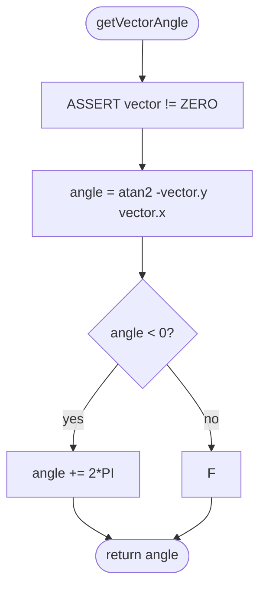

---

## 25. `getNeighborAngle(address) → double`

**Role:** Computes the bearing angle from this node to the given neighbour, in radians [0, 2π).

**Inputs:** `address`, `mobility->getCurrentPosition()`.  
**Called by:** `getPlanarNeighborsCounterClockwise()`, `findPerimeterRoutingNextHop()`.

---

## 26. `getHostName() → string`

**Role:** Returns the OMNeT++ full name of the containing host module. Used in debug/warning log output.

---

## 27. `getSelfAddress() → L3Address`

**Role:** Returns this node's Layer-3 address. For IPv6 networks, iterates the interface table to find the preferred unicast address on the first non-loopback interface.

**Inputs:** `routingTable->getRouterIdAsGeneric()`, optionally `interfaceTable` for IPv6.  
**Called by:** `initialize()`, `processBeaconTimer()`, `createBeacon()`, `sendBeacon()`, `storeSelfPositionInGlobalRegistry()`, `findGreedyRoutingNextHop()`, `findPerimeterRoutingNextHop()`, `routeDatagram()`.

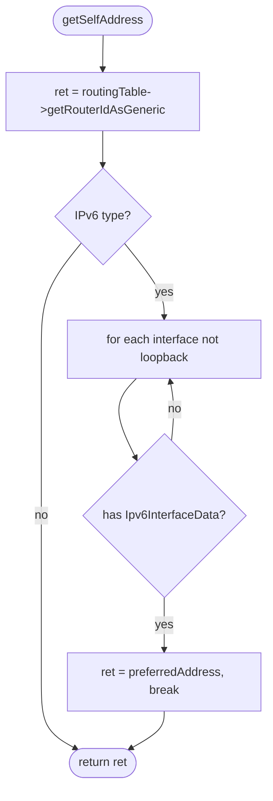

---

## 28. `getSenderNeighborAddress(networkHeader) → L3Address`

**Role:** Extracts the `senderAddress` field from the `GPSRCSOption` embedded in a received datagram's network header. This is used in perimeter routing to determine the angle from which the packet arrived.

**Inputs:** `networkHeader` — the immutable network protocol header.  
**Called by:** `findPerimeterRoutingNextHop()` via `gpsrcsOption->getSenderAddress()` directly (also available via this helper).

---

## 29. `getNextNeighborExpiration() → simtime_t`

**Role:** Returns the simulation time at which the oldest current neighbour entry will expire (`oldestTimestamp + neighborValidityInterval`). Returns `SimTime::getMaxTime()` if the table is empty.

**Inputs:** `neighborPositionTable.getOldestPosition()`, `neighborValidityInterval`.  
**Called by:** `schedulePurgeNeighborsTimer()`.

---

## 30. `purgeNeighbors()`

**Role:** Removes all neighbour entries (both legitimate and eavesdropper) from `neighborPositionTable` whose timestamps are older than `simTime() − neighborValidityInterval`.

**Called by:** `processPurgeNeighborsTimer()`.

```mermaid
flowchart LR
    A([purgeNeighbors]) --> B[removeOldPositions simTime - validityInterval]
    B --> C[removeOldEavesdroppers simTime - validityInterval]
```

---

## 31. `getPlanarNeighbors() → vector<L3Address>`

**Role:** Returns the subset of current neighbours that remain in the planar graph after applying the configured planarization algorithm. Perimeter routing requires a planar graph to guarantee loop-freedom via the right-hand rule.

**Three modes:**
- `NO_PLANARIZATION`: returns all neighbours unchanged.
- `RNG` (Relative Neighbourhood Graph): eliminates neighbour `j` if there exists a witness `w` such that `dist(self,j) > max(dist(self,w), dist(w,j))`.
- `GG` (Gabriel Graph): eliminates neighbour `j` if any witness `w` lies inside the circle with diameter `self–j` (i.e., `dist(w, midpoint) < dist(j, midpoint)`).

**Inputs:** `neighborPositionTable`, `mobility->getCurrentPosition()`, `planarizationMode`.  
**Called by:** `getPlanarNeighborsCounterClockwise()`.

```mermaid
flowchart TD
    A([getPlanarNeighbors]) --> B[for each neighborAddress]
    B --> C{planarizationMode?}
    C -- NO_PLANARIZATION --> D[return all neighborAddresses]
    C -- RNG --> E{exists witness w: dist self-j > max dist self-w dist w-j ?}
    E -- yes --> F[goto eliminate]
    E -- no --> G[add to planarNeighbors]
    C -- GG --> H[midpoint = self+j / 2]
    H --> I{exists witness w: dist w-midpoint < dist j-midpoint ?}
    I -- yes --> F
    I -- no --> G
    C -- unknown --> J[throw cRuntimeError]
    G --> B
    F --> B
    B --> K([return planarNeighbors])
```

---

## 32. `getPlanarNeighborsCounterClockwise(double startAngle) → vector<L3Address>`

**Role:** Returns the planar neighbours sorted in counter-clockwise angular order starting from `startAngle`. Used by perimeter routing to implement the right-hand rule: the first non-crossing neighbour in CCW order is the perimeter next hop.

**Inputs:** `startAngle` — the reference angle (radians), typically the angle toward the packet sender or destination.  
**Called by:** `findPerimeterRoutingNextHop()`.

```mermaid
flowchart TD
    A([getPlanarNeighborsCounterClockwise]) --> B[planarNeighbors = getPlanarNeighbors]
    B --> C[sort by angle - startAngle, wrapped to 0..2π CCW]
    C --> D([return sorted list])
```

---

## 33. `calculateChannelCapacity(senderPos, receiverPos) → double`

**Role:** Implements Shannon channel capacity under Free Space Path Loss (Chai et al., Eqs. 2–3). Distance is clamped to ≥ 1.0 m to avoid divide-by-zero at co-located nodes.

**Formula:**
```
d         = ||receiverPos − senderPos||   (min 1.0 m)
pathLoss  = λ / (4π × d)
|h|²      = pathLoss²
SNR       = Pt × |h|² / σ²
C         = log₂(1 + SNR)
```

**Inputs:** `senderPos`, `receiverPos` — 3-D Coord positions.  
**Member variables used:** `wavelength`, `transmitPower`, `noisePower`.  
**Called by:** `calculateSecrecyCapacity()`.

```mermaid
flowchart TD
    A([calculateChannelCapacity]) --> B[d = Euclidean distance]
    B --> C{d < 1.0?}
    C -- yes --> D[d = 1.0]
    C -- no --> E
    D --> E[pathLoss = wavelength / 4*PI*d]
    E --> F[channelGain = pathLoss^2]
    F --> G[SNR = transmitPower * channelGain / noisePower]
    G --> H([return log2 1+SNR])
```

---

## 34. `calculateSecrecyCapacity(senderPos, nextHopPos) → double`

**Role:** Implements the worst-case Physical Layer Secrecy Capacity (Chai et al., Eq. 4) against all globally known eavesdroppers. This is a **passive measurement** — it does not influence routing in GPSRCS.

**Formula:**
```
Cij = calculateChannelCapacity(sender, nextHop)
For each eavesdropper e in globalPositionTable:
    Cie = calculateChannelCapacity(sender, e_pos)
    CS  = max(Cij − Cie, 0)
CS_ij = min(CS over all e)   [worst-case multi-eavesdropper]
Returns Cij if no eavesdroppers known.
```

**Design note:** Uses `globalPositionTable` (not local) so that nodes outside the eavesdropper's radio range still compute correct CS values — see inline comment explaining the FIX.

**Inputs:** `senderPos`, `nextHopPos`.  
**Member variables used:** `globalPositionTable` (static), `wavelength`, `transmitPower`, `noisePower`.  
**Called by:** `findGreedyRoutingNextHop()` (post-hoc), `findPerimeterRoutingNextHop()` (post-hoc).

```mermaid
flowchart TD
    A([calculateSecrecyCapacity]) --> B[Cij = calculateChannelCapacity sender nextHop]
    B --> C[eavesdroppers = globalPositionTable.getEavesdropperAddresses]
    C --> D[EV_WARN debug count]
    D --> E{empty?}
    E -- yes --> F([return Cij])
    E -- no --> G[minCS = Cij]
    G --> H[for each eavesdropper e]
    H --> I[ePos = getEavesdropperPosition e]
    I --> J[Cie = calculateChannelCapacity sender ePos]
    J --> K[CS = max Cij-Cie 0.0]
    K --> L{CS < minCS?}
    L -- yes --> M[minCS = CS]
    L -- no --> N[next e]
    M --> N --> H
    H --> O([return minCS])
```

---

## 35. `findNextHop(destination, gpsrcsOption) → L3Address`

**Role:** Dispatcher that reads the current routing mode from the option header and delegates to either `findGreedyRoutingNextHop()` or `findPerimeterRoutingNextHop()`.

**Inputs:** `destination`, `gpsrcsOption->getRoutingMode()`.  
**Called by:** `routeDatagram()`.

```mermaid
flowchart TD
    A([findNextHop]) --> B{routingMode?}
    B -- GREEDY --> C[findGreedyRoutingNextHop]
    B -- PERIMETER --> D[findPerimeterRoutingNextHop]
    B -- unknown --> E[throw cRuntimeError]
    C --> F([return result])
    D --> F
```

---

## 36. `findGreedyRoutingNextHop(destination, gpsrcsOption) → L3Address`

**Role:** Standard GPSR greedy forwarding. Selects the neighbour **closest to the destination** within communication range R = 200 m. After selection, measures CS **post-hoc** for statistics. If no suitable greedy neighbour exists, switches to perimeter routing.

**Selection criterion:** `dist(neighbour, destination) < bestDistance` AND `dist(self, neighbour) ≤ 200 m`

**Post-hoc PLS measurement (does NOT affect selection):**
- Computes `CS = calculateSecrecyCapacity(selfPos, bestNeighborPos)`
- Increments `totalHops`
- Increments `secureHops` if `CS > GPSRCS_EPSILON`
- Updates `routeMinCS` if `CS < current minimum`
- Emits `csSignal` with the measured CS

**Inputs:** `destination`, `gpsrcsOption`, `neighborPositionTable`, `mobility`.  
**Called by:** `findNextHop()`, recursively from `findPerimeterRoutingNextHop()` when switching back to greedy.

```mermaid
flowchart TD
    A([findGreedyRoutingNextHop]) --> B[selfPos = getCurrentPosition]
    B --> C[destPos = option.getDestinationPosition]
    C --> D[bestDist = dist destPos selfPos]
    D --> E[for each neighbor in neighborPositionTable]
    E --> F[neighborPos = getPosition]
    F --> G[neighborDist = dist destPos neighborPos]
    G --> H[hopDist = dist neighborPos selfPos]
    H --> I{neighborDist >= bestDist?}
    I -- yes --> J[skip, next]
    I -- no --> K{hopDist > 200m?}
    K -- yes --> J
    K -- no --> L[bestDist = neighborDist, bestNeighbor = neighbor]
    L --> J
    J --> E
    E --> M{bestNeighbor unspecified?}
    M -- yes --> N[setRoutingMode PERIMETER]
    N --> O[setPerimeterStartPos + ForwardPos = selfPos]
    O --> P[setCurrentFaceFirstSenderAddr = selfAddr]
    P --> Q[setCurrentFaceFirstReceiverAddr = unspecified]
    Q --> R[findPerimeterRoutingNextHop]
    M -- no --> S[bestPos = getPosition bestNeighbor]
    S --> T[CS = calculateSecrecyCapacity selfPos bestPos]
    T --> U[totalHops++]
    U --> V{CS > EPSILON?}
    V -- yes --> W[secureHops++]
    V -- no --> X
    W --> X{CS < routeMinCS?}
    X -- yes --> Y[option.setRouteMinCS CS]
    X -- no --> Z
    Y --> Z[emit csSignal CS]
    Z --> AA([return bestNeighbor])
```

---

## 37. `findPerimeterRoutingNextHop(destination, gpsrcsOption) → L3Address`

**Role:** Implements GPSR's face-traversal perimeter routing using the right-hand rule on the planar graph. Used when greedy routing gets stuck (no closer neighbour within range).

**Two main branches:**

**Branch A — Switch back to greedy:** If the current node is now closer to the destination than the perimeter-routing start position was, resets option state and recurses into `findGreedyRoutingNextHop()`.

**Branch B — Continue perimeter traversal:**
1. Computes the arrival angle from the sender or toward the destination.
2. Gets planar neighbours in CCW order from that angle.
3. For each candidate, checks if the edge `self→candidate` intersects the straight line `perimeterStart→destination`. If it does, a new face has been entered: updates `currentFaceFirstSender`, resets `currentFaceFirstReceiver`, and updates the forward position.
4. Selects the first candidate whose edge does **not** intersect the perimeter-start→destination line.
5. Terminates (returns unspecified) if the face cycle completes (first sender and receiver seen again).
6. Measures CS post-hoc for the selected perimeter hop (same pattern as greedy).

**Inputs:** `destination`, `gpsrcsOption` (carries all perimeter state), `neighborPositionTable`, `mobility`.  
**Called by:** `findNextHop()`, `findGreedyRoutingNextHop()` (on mode switch).

```mermaid
flowchart TD
    A([findPerimeterRoutingNextHop]) --> B[selfPos = getCurrentPosition]
    B --> C[startPos = option.getPerimeterStartPos]
    C --> D[destPos = option.getDestinationPos]
    D --> E[selfDist = dist destPos selfPos]
    E --> F[startDist = dist destPos startPos]
    F --> G{selfDist < startDist?}
    G -- yes --> H[setRoutingMode GREEDY, clear perimeter state]
    H --> I[findGreedyRoutingNextHop recursive]
    G -- no --> J[firstSender = option.currentFaceFirstSender]
    J --> K[senderNeighborAddr = option.getSenderAddress]
    K --> L{senderAddr unspecified?}
    L -- yes --> M[neighborAngle = angle to destination]
    L -- no --> N[neighborAngle = getNeighborAngle senderAddr]
    M --> O
    N --> O[neighbors = getPlanarNeighborsCounterClockwise neighborAngle]
    O --> P[for each neighbor in sorted list]
    P --> Q[neighborPos = getNeighborPosition]
    Q --> R[intersection = computeIntersectionInsideLineSegments start dest self neighbor]
    R --> S{intersection is NaN i.e. no crossing?}
    S -- yes --> T[selectedNeighbor = neighbor, break]
    S -- no --> U[update currentFaceFirstSender = selfAddr]
    U --> V[reset currentFaceFirstReceiver = unspecified]
    V --> W[update forwardPosition = intersection]
    W --> P
    P --> X{selectedNeighbor unspecified?}
    X -- yes --> Y([return unspecified L3Address])
    X -- no --> Z{firstSender == self AND firstReceiver == selected?}
    Z -- yes --> AA[bubble End of perimeter]
    AA --> Y
    Z -- no --> AB{firstReceiver unspecified?}
    AB -- yes --> AC[setCurrentFaceFirstReceiver = selectedNeighbor]
    AB -- no --> AD
    AC --> AD[selectedPos = getNeighborPosition selected]
    AD --> AE[CS = calculateSecrecyCapacity selfPos selectedPos]
    AE --> AF[totalHops++]
    AF --> AG{CS > EPSILON?}
    AG -- yes --> AH[secureHops++]
    AG -- no --> AI
    AH --> AI{CS < routeMinCS?}
    AI -- yes --> AJ[option.setRouteMinCS CS]
    AI -- no --> AK
    AJ --> AK[emit csSignal CS]
    AK --> AL([return selectedNeighbor])
```

---

## 38. `routeDatagram(Packet *datagram, GPSRCSOption *gpsrcsOption) → Result`

**Role:** Top-level routing decision function. Drops the packet if this node is an eavesdropper. Otherwise calls `findNextHop()`, attaches the result as a tag, sets `senderAddress` in the option, and returns `ACCEPT`. Returns `DROP` if no next hop was found.

**Key behaviour:** Unlike UFRPLS, there is **no waiting mechanism** — if no hop is found, the packet is immediately dropped.

**Inputs:** `datagram`, `gpsrcsOption`, `par("isEavesdropper")`.  
**Called by:** `datagramPreRoutingHook()`, `datagramLocalOutHook()`.

```mermaid
flowchart TD
    A([routeDatagram]) --> B{isEavesdropper?}
    B -- yes --> C([return DROP])
    B -- no --> D[get source + destination from networkHeader]
    D --> E[nextHop = findNextHop destination option]
    E --> F[addTagIfAbsent NextHopAddressReq nextHop]
    F --> G{nextHop unspecified?}
    G -- yes --> H[EV_WARN no next hop]
    H --> I([return DROP])
    G -- no --> J[option.setSenderAddress getSelfAddress]
    J --> K[addTagIfAbsent InterfaceReq outputInterface]
    K --> L([return ACCEPT])
```

---

## 39. `setGPSRCSOptionOnNetworkDatagram(packet, networkHeader, gpsrcsOption)`

**Role:** Embeds the `GPSRCSOption` TLV into the correct network protocol header:
- **IPv4:** Added to `Ipv4Header` options list; header length fields updated.
- **IPv6:** Added to `Ipv6HopByHopOptionsHeader` TLV list; extension header created if absent; length rounded up to 8-byte boundary.
- **NextHop:** Added to `NextHopForwardingHeader` TLV options.

**Inputs:** `packet`, `networkHeader`, `gpsrcsOption`.  
**Called by:** `datagramLocalOutHook()`.

```mermaid
flowchart TD
    A([setGPSRCSOptionOnNetworkDatagram]) --> B[trimFront packet]
    B --> C{IPv4 header?}
    C -- yes --> D[remove Ipv4Header, addOption, update lengths, reinsert]
    C -- no --> E{IPv6 header?}
    E -- yes --> F[remove Ipv6Header, find/create HopByHop ext, insertTlvOption, update lengths, reinsert]
    E -- no --> G{NextHop header?}
    G -- yes --> H[remove NextHopHeader, insertTlvOption, update length, reinsert]
    G -- no --> I[no-op]
```

---

## 40. `findGPSRCSOptionInNetworkDatagram(networkHeader) → const GPSRCSOption*`

**Role:** Searches the immutable network header for an embedded `GPSRCSOption` TLV. Returns `nullptr` if not found.

**Called by:** `getGPSRCSOptionFromNetworkDatagram()`, `datagramLocalInHook()`.

---

## 41. `findGPSRCSOptionInNetworkDatagramForUpdate(networkHeader) → GPSRCSOption*`

**Role:** Same as above but returns a **mutable** pointer for in-place modification.

**Called by:** `getGPSRCSOptionFromNetworkDatagramForUpdate()`.

---

## 42. `getGPSRCSOptionFromNetworkDatagram(networkHeader) → const GPSRCSOption*`

**Role:** Non-nullable wrapper around `findGPSRCSOptionInNetworkDatagram()`. Throws `cRuntimeError` if no option is found, ensuring callers receive a valid pointer.

**Called by:** `datagramPreRoutingHook()`, `getSenderNeighborAddress()`.

---

## 43. `getGPSRCSOptionFromNetworkDatagramForUpdate(networkHeader) → GPSRCSOption*`

**Role:** Non-nullable mutable wrapper. Throws on not-found.

**Called by:** (available for use by any function needing to modify the option in a mutable context).

---

## 44. `datagramPreRoutingHook(Packet *datagram) → Result`

**Role:** Netfilter hook invoked for every datagram arriving at this node before the routing decision. Accepts multicast/broadcast/local-destined packets immediately. For transit packets, extracts the `GPSRCSOption` and calls `routeDatagram()`.

**Called by:** INET netfilter framework (registered in `initialize()` at priority 0).

```mermaid
flowchart TD
    A([datagramPreRoutingHook]) --> B[get destination from networkHeader]
    B --> C{multicast OR broadcast OR local?}
    C -- yes --> D([return ACCEPT])
    C -- no --> E[gpsrcsOption = getGPSRCSOptionFromNetworkDatagram]
    E --> F[routeDatagram datagram option]
    F --> G([return result])
```

---

## 45. `datagramLocalInHook(Packet *datagram) → Result`

**Role:** Called when a datagram is delivered to a local application (packet reached its final destination). Emits the accumulated per-packet minimum CS (`minCsPerPktSignal`) and end-to-end delay (`delaySignal`).

Only emits if `routeMinCS < 1e300` (i.e., the packet traversed at least one GPSRCS-routed hop).

**Called by:** INET netfilter framework on local delivery.

```mermaid
flowchart TD
    A([datagramLocalInHook]) --> B[get networkHeader]
    B --> C[opt = findGPSRCSOptionInNetworkDatagram]
    C --> D{opt exists AND routeMinCS < 1e300?}
    D -- yes --> E[emit minCsPerPktSignal routeMinCS]
    E --> F[delay = simTime - packet.creationTime]
    F --> G{delay >= 0?}
    G -- yes --> H[emit delaySignal delay]
    D -- no --> I[skip]
    H --> J([return ACCEPT])
    I --> J
```

---

## 46. `datagramLocalOutHook(Packet *packet) → Result`

**Role:** Called when a local application generates a new outgoing packet. Creates a fresh `GPSRCSOption`, embeds it into the network header, and initiates routing.

**Called by:** INET netfilter framework on local packet generation.

```mermaid
flowchart TD
    A([datagramLocalOutHook]) --> B[get networkHeader + destination]
    B --> C{multicast OR broadcast OR local?}
    C -- yes --> D([return ACCEPT])
    C -- no --> E[createGPSRCSOption destination]
    E --> F[setGPSRCSOptionOnNetworkDatagram]
    F --> G[routeDatagram packet option]
    G --> H([return result])
```

---

## 47. `handleStartOperation(LifecycleOperation *operation)`

**Role:** Called when the simulation starts or the node comes online. Configures multicast interfaces, registers self position in the global table, and starts the beacon timer.

```mermaid
flowchart LR
    A([handleStartOperation]) --> B[configureInterfaces]
    B --> C[storeSelfPositionInGlobalRegistry]
    C --> D[scheduleBeaconTimer]
```

---

## 48. `handleStopOperation(LifecycleOperation *operation)`

**Role:** Graceful shutdown. Clears the neighbour table and cancels both timers. Does not drop waiting datagrams (GPSRCS has no waiting queue unlike UFRPLS).

```mermaid
flowchart LR
    A([handleStopOperation]) --> B[neighborPositionTable.clear]
    B --> C[cancelEvent beaconTimer]
    C --> D[cancelEvent purgeNeighborsTimer]
```

---

## 49. `handleCrashOperation(LifecycleOperation *operation)`

**Role:** Identical to `handleStopOperation()` — clears table and cancels timers. No graceful teardown.

---

## 50. `finish()`

**Role:** Called at the end of the simulation. Records four scalar statistics to the `.sca` output file:
- `totalHops` — total forwarding decisions made
- `secureHops` — hops where measured CS > 0
- `globalEavesdropperCount` — number of eavesdroppers in the global table
- `secureHopRatio` — `secureHops / totalHops` (0 if no hops)

Signal-based statistics (mean CS, min CS per packet, mean delay) are handled automatically by INET's `@statistic` framework from emitted signals.

```mermaid
flowchart TD
    A([finish]) --> B[recordScalar totalHops]
    B --> C[recordScalar secureHops]
    C --> D[recordScalar globalEavesdropperCount from globalPositionTable]
    D --> E[secureRatio = totalHops>0 ? secureHops/totalHops : 0]
    E --> F[recordScalar secureHopRatio]
    F --> G[EV_INFO summary log]
```

---

## 51. `receiveSignal(source, signalID, obj, details)`

**Role:** Handles OMNeT++ notification signals. Currently responds to `linkBrokenSignal` with a warning log. The broken neighbour is not removed from the position table (marked as TODO).

**Called by:** OMNeT++ framework when a subscribed signal fires.

```mermaid
flowchart LR
    A([receiveSignal]) --> B{signalID == linkBrokenSignal?}
    B -- yes --> C[EV_WARN Received link break signal]
    B -- no --> D[ignore]
```

---

## Summary: GPSRCS vs UFRPLS Key Differences

| Aspect | GPSRCS (Baseline) | UFRPLS (PLS-aware) |
|---|---|---|
| **Routing criterion** | Distance only (GPSR) | Utility function `CS^α × d^β` |
| **Greedy constraint** | Closer to destination | None — utility guides naturally |
| **Perimeter fallback** | Yes (GG/RNG planarization) | No (removed intentionally) |
| **CS role** | Post-hoc measurement only | Primary routing criterion |
| **No-hop behaviour** | Immediate DROP | Algorithm 2 exponential wait |
| **Beacon kinematic data** | Full (pos + vel + accel + dir) | Position only |
| **Option fields** | Includes perimeter state (3 positions, sender addr) | Greedy only (destination + minCS) |

---

*Report generated: 2026-07-01 — GPSRCS Protocol Analysis / EL-GHOUCHMA DRISS*
