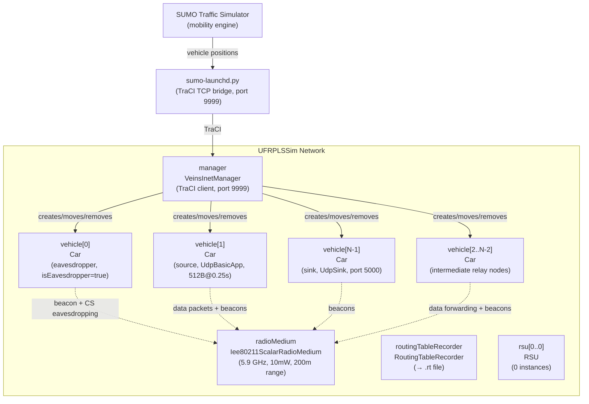
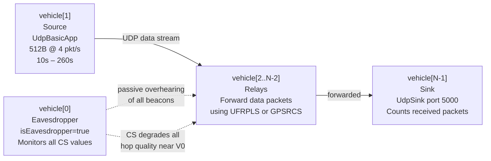
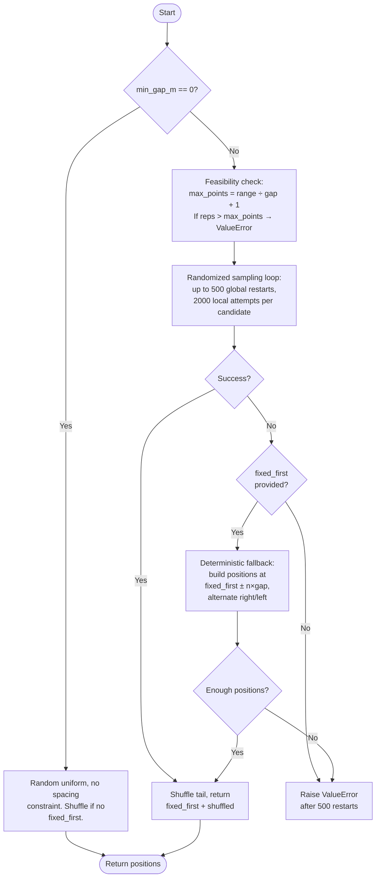
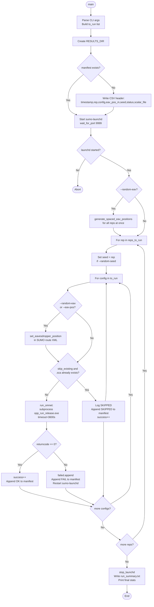
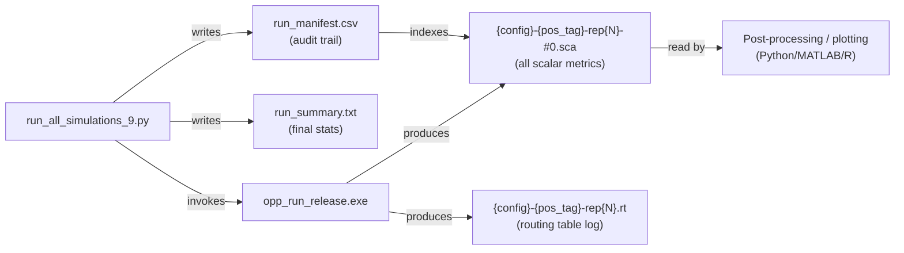
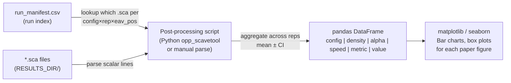
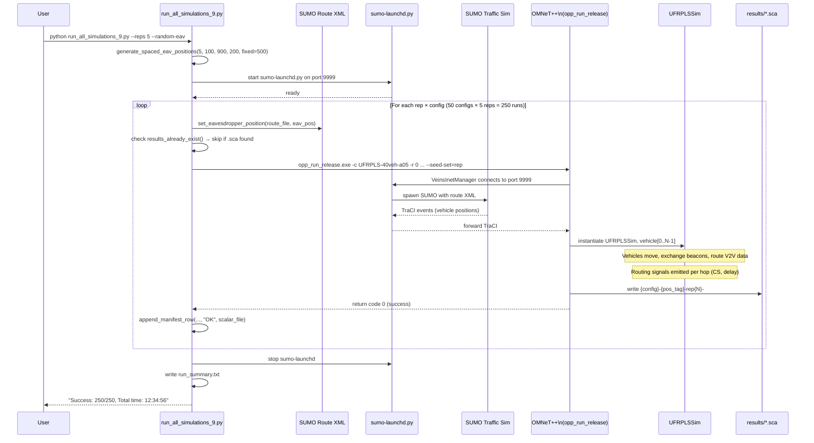

# VANET Simulation Workflow Report
## Project: UFRPLS vs. GPSRCS — Replication of Chai et al. (Electronics 2023)

**Files Analysed**
| File | Purpose |
|------|---------|
| `simulations/vanet/ufrpls/UFRPLSSim.ned` | Network topology definition |
| `simulations/vanet/ufrpls/omnetpp_5pos_full.ini` | Full simulation configuration matrix |
| `simulations/run_all_simulations_9.py` | Python batch automation runner |

---

## Table of Contents

1. [Network Topology & Architecture](#1-network-topology--architecture)
2. [Simulation Configuration Matrix](#2-simulation-configuration-matrix)
3. [Automation & Execution Logic](#3-automation--execution-logic)
4. [Generated Output Files](#4-generated-output-files)
5. [Core Project Metrics Location](#5-core-project-metrics-location)

---

## 1. Network Topology & Architecture

### 1.1 Overview

`UFRPLSSim.ned` defines the single shared network topology used by every simulation configuration in this project. It is declared under the OMNeT++ package `vanetsim.simulations.vanet.ufrpls` and named `UFRPLSSim`. All 100 configurations defined in `omnetpp_5pos_full.ini` set `network = UFRPLSSim`.

The design is deliberately minimal: it provides only the structural scaffold (radio medium, mobility manager, node placeholders), while the `.ini` file and SUMO supply all concrete parameters and vehicle trajectories.

### 1.2 Network Parameters

| Parameter | Type | Unit | Purpose |
|-----------|------|------|---------|
| `playgroundSizeX` | `double` | m | X-axis extent of the simulated physical area |
| `playgroundSizeY` | `double` | m | Y-axis extent |
| `playgroundSizeZ` | `double` | m | Z-axis extent (height ceiling) |
| `radioMediumType` | `string` | — | Runtime-polymorphic radio medium class name |
| `numberOfRSU` | `int` | — | Number of Road Side Unit submodules to instantiate |

All five parameters are supplied by the `[General]` section of the `.ini` file. The ini sets `playgroundSizeX=2000m`, `playgroundSizeY=500m`, `playgroundSizeZ=50m`, `radioMediumType="Ieee80211ScalarRadioMedium"`, and `numberOfRSU=0`.

### 1.3 Submodule Inventory

```
UFRPLSSim
├── manager           : VeinsInetManager
├── radioMedium       : <radioMediumType> like IRadioMedium
├── routingTableRecorder : RoutingTableRecorder
├── rsu[numberOfRSU]  : RSU        (0 instances in all active configs)
└── vehicle[0]        : Car        (seed; VeinsInetManager grows to vehicle[N-1])
```

#### 1.3.1 `manager : VeinsInetManager`

**Role:** The central mobility/lifecycle bridge between SUMO and OMNeT++. Implements the TraCI (Traffic Control Interface) client side.

**Responsibilities:**
- Establishes a TCP connection to `sumo-launchd.py` on port 9999 at simulation start.
- Receives SUMO vehicle insertion events; for each new vehicle it **dynamically instantiates** a `Car` module (type configured in ini as `vanetsim.simulations.vanet._nodes.Car`) into the `vehicle[]` gate array.
- On each simulation step (every `updateInterval = 0.1s`), pulls updated position/velocity data from SUMO via TraCI and forwards them to each vehicle's `VeinsInetMobility` submodule.
- When SUMO reports simulation end (`autoShutdown = true`), triggers OMNeT++ `endSimulation()`.

**Key ini parameters:**
```ini
*.manager.updateInterval = 0.1s
*.manager.host = "localhost"
*.manager.port = 9999
*.manager.autoShutdown = true
*.manager.moduleType = "vanetsim.simulations.vanet._nodes.Car"
*.manager.moduleName = "vehicle"
```

#### 1.3.2 `radioMedium : <radioMediumType> like IRadioMedium`

**Role:** Simulates the wireless propagation environment. The `like IRadioMedium` clause makes it runtime-polymorphic; the concrete type is `Ieee80211ScalarRadioMedium` (selected in `.ini`).

`Ieee80211ScalarRadioMedium` models signal propagation using scalar (single-value) SINR computation without full waveform detail, giving a good trade-off between accuracy and speed for VANET-scale experiments.

All WLAN radios (one per vehicle) register with this central `radioMedium` instance. It handles:
- Free-space path loss (used for CS calculation in UFRPLS/GPSRCS)
- Communication range enforcement (200m threshold)
- Packet collision detection (interference model)

#### 1.3.3 `routingTableRecorder : RoutingTableRecorder`

**Role:** INET utility module that listens for routing table change signals emitted by every node's IPv4 routing table. Writes human-readable log entries to a `.rt` file whenever a route is added, deleted, or modified.

The output path for each run is `results/{config}-{pos_tag}-rep{rep}.rt`. This is not used directly in the paper metrics extraction but is useful for trajectory debugging.

#### 1.3.4 `rsu[numberOfRSU] : RSU`

**Role:** Placeholder for Road Side Units. In every active simulation configuration `*.numberOfRSU = 0`, so this array is empty. The NED definition retains this submodule to allow future scenarios where fixed infrastructure nodes (e.g., at intersections) are needed.

#### 1.3.5 `vehicle[0] : Car`

**Role:** Structural seed required by OMNeT++ NED syntax — at least one element must be declared before any further dynamic instances can exist. `VeinsInetManager` populates `vehicle[1]`, `vehicle[2]`, ..., `vehicle[N-1]` at runtime as SUMO inserts each car.

The ini then assigns roles to specific indices:
- `vehicle[0]` → **eavesdropper** (`isEavesdropper = true`)
- `vehicle[1]` → **source** (UdpBasicApp sender)
- `vehicle[N-1]` → **sink** (UdpSink receiver)

### 1.4 Connections

```ned
connections allowunconnected:
```

No wired connections are declared. All inter-node communication is over the wireless radio medium. `allowunconnected` is required because INET WLAN radios connect to the radio medium through an internal mechanism, not explicit NED gates.

### 1.5 Architecture Diagram



### 1.6 Car Module Internal Structure

Each `vehicle[i]` is a `Car` module defined in `vanetsim.simulations.vanet._nodes.Car`. At runtime it contains:

```
Car
├── mobility      : VeinsInetMobility    (receives TraCI position updates)
├── wlan[0]       : Ieee80211Interface   (IEEE 802.11p radio)
│   ├── mac       : Ieee80211Mac (DCF, cwMin=7)
│   └── radio     : Ieee80211ScalarRadio (5.9GHz, 10mW)
├── ipv4          : Ipv4NetworkLayer
│   ├── configurator : HostAutoConfigurator (wlan0 auto-IP)
│   └── routingTable : Ipv4RoutingTable
├── routing       : <router> like IApp   (UFRPLS or GPSRCS, selected via **.router)
│   ├── socketIn  ← UDP socket from transport layer
│   └── socketOut → UDP socket to transport layer
└── app[0]        : UdpBasicApp / UdpSink (vehicle[1] / vehicle[N-1] only)
```

---

## 2. Simulation Configuration Matrix

### 2.1 INI File Structure

`omnetpp_5pos_full.ini` (804 lines) organises its 100 named configurations using OMNeT++'s `extends` inheritance mechanism. Each configuration inherits from a base that defines its vehicle count and SUMO map, then overrides only the parameter it varies.

```
[General]             ← global defaults for ALL configs
    ├── [Config GPSRCS-{N}veh]         ← GPSRCS, slow speed (40-60 km/h)
    │       └── [Config GPSRCS-{N}veh-fast]   ← extends GPSRCS-{N}veh, fast speed
    ├── [Config UFRPLS-Base-{N}veh]    ← UFRPLS, slow speed base
    │       └── [Config UFRPLS-{N}veh-a{XX}]  ← extends Base, varies alpha only
    └── [Config UFRPLS-Base-{N}veh-fast] ← UFRPLS, fast speed base
            └── [Config UFRPLS-{N}veh-a{XX}-fast] ← extends fast Base
```

### 2.2 Global `[General]` Parameters

#### 2.2.1 Simulation Control

| Parameter | Value | Meaning |
|-----------|-------|---------|
| `cmdenv-express-mode` | `true` | Suppress per-event log output for speed |
| `cmdenv-autoflush` | `true` | Flush stdout after each status line |
| `cmdenv-status-frequency` | `1s` | Print progress every simulation second |
| `sim-time-limit` | `261s` | Default total simulation duration |
| `debug-on-errors` | `false` | No debugger pop-up on error |
| `print-undisposed` | `false` | Suppress undisposed module warnings at end |

#### 2.2.2 Result Recording

| Parameter | Value | Effect |
|-----------|-------|--------|
| `**.scalar-recording` | `true` | All `@statistic` scalars written to `.sca` |
| `**.vector-recording` | `false` | Time-series vectors suppressed (saves disk space) |

This configuration records **aggregate statistics only** — means, mins, maxes — not the full time series of every event. This is intentional for the paper's box-plot and bar-chart style figures.

#### 2.2.3 VeinsInetManager Settings

```ini
*.manager.updateInterval = 0.1s      # TraCI poll rate: 10 position updates/sec
*.manager.host           = "localhost"
*.manager.port           = 9999       # must match sumo-launchd.py --port
*.manager.autoShutdown   = true       # end OMNeT++ when SUMO scenario ends
*.manager.moduleType = "vanetsim.simulations.vanet._nodes.Car"
*.manager.moduleName     = "vehicle"  # creates vehicle[0], vehicle[1], ...
```

#### 2.2.4 Mobility Constraint Area

```ini
*.vehicle[*].mobility.typename = "VeinsInetMobility"
*.vehicle[*].mobility.constraintAreaMinX =    0m
*.vehicle[*].mobility.constraintAreaMaxX = 1000m   # 1 km road segment
*.vehicle[*].mobility.constraintAreaMinY =  -50m
*.vehicle[*].mobility.constraintAreaMaxY =   50m   # ±50 m lateral tolerance
*.vehicle[*].mobility.constraintAreaMinZ = 0m
*.vehicle[*].mobility.constraintAreaMaxZ = 0m      # flat 2D road
```

Note: `playgroundSizeX = 2000m` (set in NED parameters), but the mobility constraint area is only 1000 m. The playground is larger to prevent boundary artefacts near the map edges.

#### 2.2.5 Routing and IP Layer

```ini
num-rngs = 3                              # three independent RNG streams
**.mobility.rng-0 = 1                     # mobility uses RNG stream 1
**.routing.wlan[*].mac.rng-0 = 2         # MAC backoff uses RNG stream 2
**.ipv4.configurator.typename = "HostAutoConfigurator"
**.ipv4.configurator.interfaces = "wlan0" # auto-assign IP to wlan0
**.ipv4.routingTable.netmaskRoutes = ""   # disable default route auto-insertion
*.radioMediumType = "Ieee80211ScalarRadioMedium"
**.routing.beaconInterval = 1s            # HELLO beacon every 1 second
```

#### 2.2.6 IEEE 802.11p Radio Parameters (Chai et al. Table 2)

| Parameter | ini Key | Value | Standard Ref |
|-----------|---------|-------|-------------|
| Frequency band | `radio.bandName` | `"5.9 GHz"` | IEEE 802.11p / DSRC |
| Channel | `radio.channelNumber` | `3` | CCH (Control Channel) |
| Transmit power | `radio.transmitter.power` | `10mW` (0.01 W) | Chai Table 2 |
| Channel bandwidth | `radio.bandwidth` | `10 MHz` | 802.11p |
| CSMA/CA min window | `mac.dcf.channelAccess.cwMin` | `7` | 802.11p DCF |
| Communication range | `transmitter.communicationRange` | `200m` | Chai Table 2 |
| Receiver sensitivity | `radio.receiver.sensitivity` | `-85 dBm` | Typical 802.11p |
| Energy detection | `radio.receiver.energyDetection` | `-85 dBm` | Same as sensitivity |
| Interference range | `transmitter.interferenceRange` | `100m` | |
| Ignore interference | `radio.receiver.ignoreInterference` | `true` | Simplified model |

#### 2.2.7 PLS Parameters (Chai et al. Table 2)

These appear in `[General]` as defaults and are inherited by all configurations:

| Parameter | ini Key | Value | Description |
|-----------|---------|-------|-------------|
| Routing weight | `routing.alpha` | `0.5` | Balance between CS and distance in UFRPLS utility |
| Transmit power | `routing.transmitPower` | `0.01` W | Used in CS formula: Pt |
| Noise power | `routing.noisePower` | `3.981e-21` W | σ² thermal noise at room temp, 10 MHz BW |
| Wavelength | `routing.wavelength` | `0.05085` m | λ = c/f = 3×10⁸/5.9×10⁹ |
| Initial wait window | `routing.initialWaitWindow` | `0.000130` s | tw₁ = 130 µs (UFRPLS only) |
| Wait threshold | `routing.waitThreshold` | `0.065` s | T = 65 ms total wait budget (UFRPLS only) |
| Is eavesdropper | `routing.isEavesdropper` | `false` | Default: no node is eavesdropper |

The global `*.vehicle[0].routing.isEavesdropper = true` line overrides the default specifically for `vehicle[0]` in every config.

#### 2.2.8 Application Layer

```ini
# Sender (always vehicle[1])
*.vehicle[1].numApps = 1
*.vehicle[1].app[0].typename      = "UdpBasicApp"
*.vehicle[1].app[0].destPort      = 5000
*.vehicle[1].app[0].messageLength = 512B        # 512-byte payload
*.vehicle[1].app[0].sendInterval  = 0.25s       # 4 packets/second
*.vehicle[1].app[0].startTime     = 10s         # warm-up period
*.vehicle[1].app[0].stopTime      = 260s        # 250 seconds active
*.vehicle[1].app[0].packetName    = "V2V-Data"
```

Each named config then sets:
```ini
*.vehicle[1].app[0].destAddresses = "UFRPLSSim.vehicle[N-1]"  # last vehicle is sink
*.vehicle[N-1].numApps = 1
*.vehicle[N-1].app[0].typename  = "UdpSink"
*.vehicle[N-1].app[0].localPort = 5000
```

**Packet budget per normal run:** 250 s / 0.25 s = **1000 packets** attempted.

### 2.3 Configuration Taxonomy

#### 2.3.1 GPSRCS Configurations

GPSRCS configs only vary vehicle count and speed. There is no alpha parameter (GPSRCS does not use alpha for routing — it uses pure distance).

| Config Name | Density | Speed Range | SUMO Map |
|-------------|---------|-------------|----------|
| `GPSRCS-20veh` | 20 | 40–60 km/h | `launchd_20veh_40-60kmh.xml` |
| `GPSRCS-40veh` | 40 | 40–60 km/h | `launchd_40veh_40-60kmh.xml` |
| `GPSRCS-60veh` | 60 | 40–60 km/h | `launchd_60veh_40-60kmh.xml` |
| `GPSRCS-80veh` | 80 | 40–60 km/h | `launchd_80veh_40-60kmh.xml` |
| `GPSRCS-100veh` | 100 | 40–60 km/h | `launchd_100veh_40-60kmh.xml` |
| `GPSRCS-20veh-fast` | 20 | 80–120 km/h | `launchd_20veh_80-120kmh.xml` |
| `GPSRCS-40veh-fast` | 40 | 80–120 km/h | `launchd_40veh_80-120kmh.xml` |
| `GPSRCS-60veh-fast` | 60 | 80–120 km/h | `launchd_60veh_80-120kmh.xml` |
| `GPSRCS-80veh-fast` | 80 | 80–120 km/h | `launchd_80veh_80-120kmh.xml` |
| `GPSRCS-100veh-fast` | 100 | 80–120 km/h | `launchd_100veh_80-120kmh.xml` |

#### 2.3.2 UFRPLS Base Configurations

Five base configs per speed regime (10 total); alpha defaults to 0.5. Used as inheritance parents only — not executed directly in the batch runner.

#### 2.3.3 UFRPLS Alpha-Sweep Configurations

For each density × speed, 9 alpha values (0.1 through 0.9) are defined. The full matrix in the ini is:

```
5 densities × 9 alphas × 2 speeds = 90 UFRPLS configs
```

Config naming: `UFRPLS-{N}veh-a{XX}[-fast]`
where `{XX}` is alpha×10, e.g. `a05` = α=0.5, `a01` = α=0.1.

### 2.4 Simulation Time Adjustments for Fast Configs

Higher speeds mean vehicles enter and exit the road segment faster, requiring adjusted timing:

| Config Suffix | Density | sim-time-limit | App startTime | App stopTime | Duration |
|---------------|---------|---------------|--------------|-------------|---------|
| (normal) | any | 261s | 10s | 260s | 250s |
| `-fast` 20veh | 20 | 261s | 10s | 260s | 250s |
| `-fast` 40veh | 40 | 284s | 33s | 283s | 250s |
| `-fast` 60veh | 60 | 286s | 35s | 285s | 250s |
| `-fast` 80veh | 80 | 296s | 45s | 295s | 250s |
| `-fast` 100veh | 100 | 400s | 109s | 359s | 250s |

The app always runs for exactly 250 seconds; the extended `sim-time-limit` accommodates the longer warm-up period needed for all vehicles to spawn and reach their initial positions at higher speeds.

### 2.5 Vehicle Role Assignment



### 2.6 Configuration Count Summary

| Protocol | Speed | Defined in INI | Executed by Runner |
|----------|-------|---------------|-------------------|
| GPSRCS | 40-60 km/h | 5 | 5 |
| GPSRCS | 80-120 km/h | 5 | 5 |
| UFRPLS | 40-60 km/h | 45 (9α×5N) | 25 (5α×5N) |
| UFRPLS | 80-120 km/h | 45 (9α×5N) | 15 (3α×5N) |
| **Total** | | **100** | **50** |

The runner's subset: `alpha = ["a05","a03","a07","a01","a09"]` for slow speed; `["a05","a03","a07"]` for fast. This covers the five primary alpha values (0.1, 0.3, 0.5, 0.7, 0.9) for the slow-speed regime where all paper figures are plotted, and a core subset for the fast-speed sensitivity analysis.

---

## 3. Automation & Execution Logic

### 3.1 Script Overview

`run_all_simulations_9.py` (644 lines) is the single entry point for running all simulation experiments. It:
1. Builds an ordered list of all configurations to run
2. Starts SUMO's `sumo-launchd.py` bridge process
3. Iterates over (config × repetition) pairs
4. Manages eavesdropper position injection into SUMO route XML
5. Invokes OMNeT++ as a subprocess for each run
6. Records results in a manifest CSV
7. Restarts `sumo-launchd` after any failure

### 3.2 Path Configuration

```python
PYTHON2_EXE  = r"C:\...\omnetpp-5.6.2\tools\win64\mingw64\bin\python2.exe"
BASH_EXE     = r"C:\...\omnetpp-5.6.2\tools\win64\usr\bin\bash.exe"
OPP_RUN      = "/c/Users/driss/VANET/omnetpp-5.6.2/bin/opp_run_release"   # Unix path for bash
OPP_RUN_WIN  = r"C:\...\omnetpp-5.6.2\bin\opp_run_release.exe"            # Windows for subprocess
SIM_DIR_WIN  = r"C:\...\simulations\vanet\ufrpls"
LAUNCHD_PY   = r"C:\...\WorkSpaceVanet\veins\sumo-launchd.py"
SUMO_EXE     = r"C:\...\sumo-1.8.0\bin\sumo.exe"
LAUNCHD_PORT = 9999
RESULTS_DIR  = SIM_DIR_WIN + r"\results"
MAPS_PLS_DIR = SIM_DIR_WIN + r"\..\..\..\_maps\pls"  # resolved: WorkSpaceVanet\_maps\pls
```

Two forms of path are maintained for each executable: Unix-style paths (for the bash subprocess) and Windows-style (for direct `subprocess.run`). The batch runner uses Windows-style paths for all actual execution.

**NED paths** — 8 directories given to OMNeT++ via `-n`:
```
VANETSim/simulations
VANETSim/src
inet/src
inet/examples
inet/tutorials
inet/showcases
veins/examples/veins
veins/src/veins
```

### 3.3 CONFIGS List Construction

```python
speed_ranges = ["", "-fast"]
alpha = ["a05", "a03", "a07", "a01", "a09"]   # execution order: 0.5, 0.3, 0.7, 0.1, 0.9
n = ["20", "40", "60", "80", "100"]

CONFIGS = []
for speed in speed_ranges:           # first slow, then fast
    for veh in n:                     # GPSRCS for all densities
        CONFIGS.append(f"GPSRCS-{veh}veh{speed}")
    alpha_for_speed = ["a05","a03","a07"] if speed == "-fast" else alpha
    for a in alpha_for_speed:         # UFRPLS by alpha, then density
        for veh in n:
            CONFIGS.append(f"UFRPLS-{veh}veh-{a}{speed}")
```

**Resulting CONFIGS list (50 entries):**

```
 1-5:   GPSRCS-{20,40,60,80,100}veh
 6-10:  UFRPLS-{20,40,60,80,100}veh-a05
11-15:  UFRPLS-{20,40,60,80,100}veh-a03
16-20:  UFRPLS-{20,40,60,80,100}veh-a07
21-25:  UFRPLS-{20,40,60,80,100}veh-a01
26-30:  UFRPLS-{20,40,60,80,100}veh-a09
31-35:  GPSRCS-{20,40,60,80,100}veh-fast
36-40:  UFRPLS-{20,40,60,80,100}veh-a05-fast
41-45:  UFRPLS-{20,40,60,80,100}veh-a03-fast
46-50:  UFRPLS-{20,40,60,80,100}veh-a07-fast
```

The ordering ensures GPSRCS runs first within each speed band (providing baseline data before alpha-sweep UFRPLS runs).

### 3.4 SUMO Launch and Teardown

#### `start_launchd()`

```python
cmd = [PYTHON2_EXE, LAUNCHD_PY, "-vv", "-c", SUMO_EXE, "--port", 9999]
proc = subprocess.Popen(cmd, stdout=PIPE, stderr=STDOUT)
if wait_for_port(9999, timeout=20):
    return proc   # success
```

`wait_for_port()` polls `127.0.0.1:9999` with 0.5 s intervals for up to 20 s. When `sumo-launchd.py` accepts a connection on that port, it is ready to receive TraCI requests from OMNeT++'s `VeinsInetManager`.

**Why Python 2?** `sumo-launchd.py` is a legacy Veins script written for Python 2. The OMNeT++-bundled `python2.exe` is used to avoid requiring a system Python 2 installation.

#### `stop_launchd(proc)`

```python
proc.terminate()
proc.wait(timeout=5)   # grace period
# if still alive: proc.kill()
```

#### Failure Recovery

After any OMNeT++ run that returns a non-zero exit code, the script:
1. Logs the failure
2. Stops `sumo-launchd`
3. Sleeps 2 seconds
4. Restarts `sumo-launchd`

This is necessary because SUMO crashes (which produce `WSAECONNRESET (10054)` on Windows) leave `sumo-launchd.py` in a broken state where subsequent TraCI connections fail immediately.

### 3.5 Eavesdropper Position Management

The eavesdropper is `vehicle[0]` in OMNeT++. Its physical starting position on the road is controlled by the `departPos` attribute in the SUMO route XML file.

#### `route_file_for_config(config_name)`

```python
m = re.search(r"(?:UFRPLS|GPSRCS)-(\d+)veh", config_name)
veh = m.group(1)           # "20", "40", "60", "80", or "100"
is_fast = config_name.endswith("-fast")

if is_fast:
    return MAPS_PLS_DIR + f"/traffic_{veh}veh_80-120kmh_rou.xml"
return MAPS_PLS_DIR + f"/traffic_{veh}veh_40-60kmh_rou.xml"
```

Maps config name → SUMO route file. There are 10 route files total (5 densities × 2 speeds).

#### `set_eavesdropper_position(route_file, new_pos, dry_run=False)`

```python
pattern = re.compile(
    r'(<vehicle\s+id="vehicle00"[\s\S]*?departPos=")(\d+(?:\.\d+)?)(")' 
)
new_content, count = pattern.subn(rf'\g<1>{round(new_pos,1)}\g<3>', content, count=1)
```

The regex uses `[\s\S]*?` (dotall, non-greedy) to match across newlines — needed because the `<vehicle>` tag in SUMO XML typically spans multiple lines. The replacement preserves the opening attribute text (`\g<1>`) and the closing quote (`\g<3>`), swapping only the numeric value.

If `dry_run=True`, the file is read and the pattern is matched, but no write occurs. The function returns `new_pos` on success, `None` if `vehicle00` was not found.

#### `generate_spaced_eav_positions(reps, min_pos, max_pos, min_gap_m, fixed_first=None)`

This is the most algorithmically complex function in the script. It produces `reps` eavesdropper positions in `[min_pos, max_pos]` such that every pair is at least `min_gap_m` metres apart.



**Default invocation** with `--random-eav` and `--baseline-first` (defaults):
- `min_pos=100.0`, `max_pos=900.0`, `min_gap_m=200.0`, `fixed_first=500.0`
- Maximum feasible positions in [100, 900] with 200m gap: 5 (at 100, 300, 500, 700, 900)
- With `reps=5`: positions are `[500, 300, 700, 100, 900]` (or similar valid arrangement)

### 3.6 Output File Path Construction

```python
def position_tag(eav_pos):
    if eav_pos is None: return f"e{DEFAULT_EAV_POS}"   # "e500"
    return f"e{int(round(eav_pos))}"

def expected_output_paths(config_name, rep=1, eav_pos=None):
    pos_tag = position_tag(eav_pos)    # e.g. "e500", "e300"
    scalar_rel = f"results/{config_name}-{pos_tag}-rep{rep}-#0.sca"
    scalar_abs = SIM_DIR_WIN + "\\" + scalar_rel
    rt_abs = RESULTS_DIR + f"\\{config_name}-{pos_tag}-rep{rep}.rt"
```

**Example paths for `UFRPLS-40veh-a05`, rep=2, eav_pos=700.0:**
```
Scalar:  results/UFRPLS-40veh-a05-e700-rep2-#0.sca
Routing: results/UFRPLS-40veh-a05-e700-rep2.rt
```

### 3.7 OMNeT++ Run Command

```python
cmd = [
    OPP_RUN_WIN,
    "-u", "Cmdenv",                           # non-GUI, command-line mode
    "-c", config_name,                         # e.g. "UFRPLS-40veh-a05"
    "-r", "0",                                 # always run index 0
    "-n", NED_PATHS,                          # semicolon-separated NED search paths
    "-l", "VANETSim",                         # load VANETSim.dll shared library
    "--cmdenv-express-mode=true",
    "--cmdenv-autoflush=false",
    "--cmdenv-status-frequency=30s",          # less verbose than ini's 1s
    f"--output-scalar-file={scalar_file}",    # custom path/name for .sca
    f"--seed-set={seed}",                     # per-rep seed (if --random-seed)
    "omnetpp_5pos_full.ini",
]
result = subprocess.run(cmd, cwd=SIM_DIR_WIN, timeout=3600, env=env)
```

Key observations:
- **`-r 0` always**: each OMNeT++ configuration defines exactly one run. Position variation across repetitions is achieved by modifying the SUMO route XML before each run, not by using multiple OMNeT++ run indices.
- **`--seed-set={rep}`**: sets OMNeT++'s RNG seed equal to the repetition number, ensuring different random sequences for each rep while remaining fully reproducible.
- **1-hour timeout**: a safety net; no normal simulation should take that long.
- **`-l VANETSim`**: loads the compiled simulation library `VANETSim.dll` containing UFRPLS and GPSRCS routing code.

### 3.8 Main Execution Loop



### 3.9 Skip Logic

```python
def results_already_exist(config_name, rep=1, eav_pos=None):
    paths = expected_output_paths(config_name, rep=rep, eav_pos=eav_pos)
    return os.path.isfile(paths["scalar_abs"])  # .sca only
```

The skip check looks **only at the `.sca` file**. If it exists, the run is considered complete and will be skipped on re-runs. This makes the batch runner safe to interrupt and resume.

### 3.10 CLI Reference

| Argument | Default | Description |
|----------|---------|-------------|
| `--dry-run` | off | Print commands, do not execute |
| `--start N` | 1 | Skip first N-1 configs in CONFIGS list |
| `--config NAME[,NAME]` | all | Run only specified config(s) |
| `--reps N` | 1 | Number of repetitions per config |
| `--rep-list 3,5` | — | Explicit rep numbers to run |
| `--random-eav` | off | Randomize eavesdropper position across reps |
| `--eav-pos V` | — | Fix eavesdropper at V metres for all reps |
| `--eav-min V` | 100.0 | Lower bound of eavesdropper range (m) |
| `--eav-max V` | 900.0 | Upper bound of eavesdropper range (m) |
| `--eav-min-gap V` | 200.0 | Minimum spacing between positions (m) |
| `--baseline-first` | on | rep1 always uses `--baseline-eav-pos` |
| `--no-baseline-first` | — | All reps use random positions |
| `--baseline-eav-pos V` | 500.0 | Baseline position for rep1 |
| `--random-seed` | on | Seed = rep number |
| `--no-random-seed` | — | Use simulator default seed |
| `--skip-existing` | on | Skip config if .sca already exists |
| `--no-skip-existing` | — | Force re-run even if .sca exists |

### 3.11 Log Format

```
[HH:MM:SS] [>>] Running OMNeT++ config: UFRPLS-40veh-a05 [seed=1]
[HH:MM:SS] [OK] Finished in 0:08:23
[HH:MM:SS] [--] Elapsed: 0:08:23  |  Remaining: ~6:54:00
```

Level symbols: `>>` INFO, `OK` success, `!!` failure, `??` warning, `--` timing.

---

## 4. Generated Output Files

### 4.1 Scalar Result File (`.sca`)

**Path pattern:** `simulations/vanet/ufrpls/results/{config}-{pos_tag}-rep{rep}-#0.sca`

**Example:** `results/UFRPLS-40veh-a05-e500-rep1-#0.sca`

**Format:** OMNeT++ plain-text scalar format. Structure:

```
version 2
run {config}-0-{timestamp}
attr configname {config}
attr datetime {ISO-datetime}
attr seedset {seed}
...
scalar UFRPLSSim.vehicle[2].routing secrecyCapacity:mean 1.234567
scalar UFRPLSSim.vehicle[2].routing secrecyCapacity:max  3.456789
scalar UFRPLSSim.vehicle[2].routing endToEndDelay:mean   0.002345
scalar UFRPLSSim.vehicle[1].app[0] packetSent:count      1000
scalar UFRPLSSim.vehicle[N-1].app[0] packetReceived:count 987
scalar UFRPLSSim.vehicle[2].routing totalHops            4321
scalar UFRPLSSim.vehicle[2].routing secureHops           3890
scalar UFRPLSSim.vehicle[2].routing secureHopRatio       0.9003
...
```

One `.sca` file is produced per OMNeT++ run. Since `**.vector-recording = false`, no `.vec` files are generated. The `-#0` suffix is OMNeT++ convention for run index 0.

**Size:** Typically 50–200 KB per run depending on the number of vehicles.

### 4.2 Routing Table File (`.rt`)

**Path pattern:** `results/{config}-{pos_tag}-rep{rep}.rt`

**Example:** `results/GPSRCS-60veh-e500-rep1.rt`

**Format:** INET `RoutingTableRecorder` plain-text log:

```
<time>  <module>  <event>  <dest>/<mask>  <gw>  <iface>  <metric>
10.001  vehicle[3].ipv4.routingTable  added  192.168.1.5/32  *  wlan0  0
...
```

One entry per routing table modification event. Primarily useful for topology debugging and tracing packet forwarding paths. Not used directly in paper metric extraction — metrics come from `.sca` files.

**Note:** The `.rt` fallback path `{SIM_DIR_WIN}/{config}-0.rt` (without pos_tag/rep) refers to old runs before the naming convention was updated.

### 4.3 Run Manifest (`run_manifest.csv`)

**Path:** `results/run_manifest.csv`

**Format:** CSV, created on first run, rows appended for every subsequent run:

```csv
timestamp,rep,config,eav_pos_m,seed,status,scalar_file
2024-01-15T14:32:11,1,GPSRCS-20veh,500.0,1,OK,results/GPSRCS-20veh-e500-rep1-#0.sca
2024-01-15T14:41:03,1,UFRPLS-20veh-a05,500.0,1,OK,results/UFRPLS-20veh-a05-e500-rep1-#0.sca
2024-01-15T14:41:03,2,UFRPLS-20veh-a05,700.0,2,OK,results/UFRPLS-20veh-a05-e700-rep2-#0.sca
2024-01-15T14:41:05,1,UFRPLS-60veh-a09,,1,SKIPPED,results/UFRPLS-60veh-a09-e500-rep1-#0.sca
2024-01-15T15:02:44,3,GPSRCS-100veh-fast,300.0,3,FAIL,results/GPSRCS-100veh-fast-e300-rep3-#0.sca
```

**Column descriptions:**

| Column | Description |
|--------|-------------|
| `timestamp` | ISO-8601 datetime when the run finished |
| `rep` | Repetition number |
| `config` | OMNeT++ configuration name |
| `eav_pos_m` | Eavesdropper departure position in metres (empty = default e500) |
| `seed` | OMNeT++ seed-set value used (empty = simulator default) |
| `status` | `OK`, `FAIL`, or `SKIPPED` |
| `scalar_file` | Relative path to the `.sca` output file |

The manifest is the primary audit trail for post-processing scripts that need to know which `.sca` files correspond to which experimental conditions.

### 4.4 Run Summary (`run_summary.txt`)

**Path:** `results/run_summary.txt`

**Format:** Plain text, overwritten at the end of each complete batch run:

```
Date       : 2024-01-15 18:47:32.123456
Total time : 4:15:08
Success    : 47/50
Failed     : ['GPSRCS-100veh-fast#rep3', 'UFRPLS-80veh-a01-fast#rep2']
```

A quick human-readable summary of the last batch. Not intended for programmatic parsing — use `run_manifest.csv` for that.

### 4.5 Output File Relationships



---

## 5. Core Project Metrics Location

### 5.1 Metric Recording Architecture

All metrics are emitted as OMNeT++ **signals** inside the routing modules (UFRPLS.cc, GPSRCS.cc) and recorded as **scalars** in the `.sca` file. Since `**.vector-recording = false`, only aggregate statistics (mean, min, max, count) are available — not per-event time series.

The general pattern for a metric named `X` in the NED file:
```ned
@signal[X](type=double);
@statistic[X](source=X; record=mean,max,min,vector; interpolationmode=none);
```
Then in `.cc`: `emit(xSignal, value);`
And in `.sca`: `scalar {module} X:mean`, `X:max`, `X:min`

### 5.2 Secrecy Capacity (CS)

**Mathematical Definition:**
```
C_ij = log₂(1 + Pt × (λ/4πd_ij)² / σ²)     (Shannon channel capacity)
CS_ij = max(C_ij − max_e(C_ie), 0)           (worst-case secrecy over all eavesdroppers)
```

Where `d_ij` = distance to neighbour j, `d_ie` = distance from i to each eavesdropper e.

**Signal name:** `csSignal` (both UFRPLS and GPSRCS)

**Emitted in:**
- UFRPLS: `findGreedyRoutingNextHop()` for each candidate hop, and at every hop during `routeDatagram()`
- GPSRCS: `routeDatagram()` after selecting the best distance-based hop

**Location in `.sca`:**
```
scalar UFRPLSSim.vehicle[N].routing secrecyCapacity:mean  X.XXX
scalar UFRPLSSim.vehicle[N].routing secrecyCapacity:max   X.XXX
scalar UFRPLSSim.vehicle[N].routing secrecyCapacity:min   X.XXX
```

**Key distinction between protocols:**
- In **UFRPLS**: CS drives the routing decision. A hop with CS=0 is never selected (the packet waits instead).
- In **GPSRCS**: CS is measured *after* the distance-based routing decision. A hop with CS=0 still occurs — the packet is forwarded but `secureHops` is not incremented.

### 5.3 Minimum Secrecy Capacity Per Packet

**Signal name:** `minCsPerPktSignal`

**Semantics:** The minimum CS value observed across all hops taken by a successfully delivered packet. This captures the worst-case security along the entire path, not just per-hop averages.

**Location in `.sca`:**
```
scalar UFRPLSSim.vehicle[N].routing minSecrecyCapacityPerPacket:mean  X.XXX
```

In UFRPLS, this value is ≥ 0 by construction (zero-CS hops are blocked by the waiting mechanism). In GPSRCS, it can be 0 if the best available hop was line-of-sight to the eavesdropper.

### 5.4 Packet Delivery Ratio (PDR)

**Not a direct signal** — derived by post-processing from INET application module scalars:

```
PDR = packetReceived:count (vehicle[N-1]) / packetSent:count (vehicle[1])
```

**Location in `.sca`:**
```
scalar UFRPLSSim.vehicle[1].app[0]   packetSent:count     1000
scalar UFRPLSSim.vehicle[N-1].app[0] packetReceived:count 987
```

**Total packets attempted** = 1000 per normal run (250 s / 0.25 s interval), less for fast configs with warm-up adjustments (also 1000, since app duration is always 250 s).

**Drop sources:**
- **UFRPLS**: Packet dropped in `processWaitingRetryTimer()` when `totalWaited > waitThreshold` (65 ms) and still no secure hop found. Also dropped if no neighbours at all (network partition).
- **GPSRCS**: Packet dropped immediately in `routeDatagram()` when neither greedy nor perimeter routing finds a next hop.

### 5.5 End-to-End Delay

**Signal name:** `delaySignal`

**Semantics:** Time from packet creation at the source application to receipt at the sink application, including all queuing, MAC backoff, per-hop propagation, and the UFRPLS exponential-backoff waiting time.

**Computed in:** `datagramLocalInHook()` of the **destination** vehicle's routing module:
```cpp
simtime_t delay = simTime() - packet->getCreationTime();
emit(delaySignal, delay.dbl());
```

INET's `UdpBasicApp` stamps the packet with its creation time; the routing module reads this on arrival.

**Location in `.sca`:**
```
scalar UFRPLSSim.vehicle[N-1].routing endToEndDelay:mean  0.001234
scalar UFRPLSSim.vehicle[N-1].routing endToEndDelay:max   0.045678
scalar UFRPLSSim.vehicle[N-1].routing endToEndDelay:min   0.000123
```

**UFRPLS vs GPSRCS difference:** UFRPLS delay includes the exponential-backoff waiting time (up to 65 ms per hop), so it is expected to be higher than GPSRCS delay when waiting occurs. However, UFRPLS achieves higher PDR by waiting rather than dropping, so the delay-vs-PDR trade-off is a key result in the paper.

### 5.6 Hop Count Metrics

**Recorded in `finish()`** — end-of-simulation counters, not signals:

| Scalar Name | Type | Description |
|-------------|------|-------------|
| `totalHops` | `int` | Total number of forwarding decisions made across all packets |
| `secureHops` | `int` | Forwarding decisions where CS > 0 (secure link was used) |
| `secureHopRatio` | `double` | `secureHops / totalHops` |
| `globalEavesdropperCount` | `int` | Number of eavesdroppers in global position table (always 1) |

**Location in `.sca`:**
```
scalar UFRPLSSim.vehicle[N].routing totalHops             4321
scalar UFRPLSSim.vehicle[N].routing secureHops            3890
scalar UFRPLSSim.vehicle[N].routing secureHopRatio        0.9003
scalar UFRPLSSim.vehicle[N].routing globalEavesdropperCount  1
```

**UFRPLS note:** `secureHopRatio` should be ≈ 1.0 or exactly 1.0 in practice, because the waiting mechanism ensures a zero-CS hop is only used as a last resort when the wait threshold is exceeded. `secureHops < totalHops` indicates edge cases where `waitThreshold` was exceeded and a non-secure hop was forced.

**GPSRCS note:** `secureHopRatio` will typically be < 1.0 because GPSRCS sometimes selects the closest neighbour even when that neighbour has poor CS due to proximity to the eavesdropper.

### 5.7 Drop Cause Metrics

Drop tracking uses INET's built-in network-layer drop counters (accessible in `.sca` under `ipv4.ip`) plus custom counters in the routing modules:

| Scalar | Module | Description |
|--------|--------|-------------|
| `droppedPackets:count` | `vehicle[N].routing` | Total packets dropped by routing module |
| `ipv4.ip.droppedPkNoRoute:count` | `vehicle[N].ipv4.ip` | IPv4-layer no-route drops |
| `ipv4.ip.droppedPkHopLimitReached:count` | `vehicle[N].ipv4.ip` | TTL-exceeded drops |

UFRPLS-specific: when `processWaitingRetryTimer()` exhausts the wait budget, it calls `PacketDropDetails` with reason `NO_ROUTE_FOUND` and drops the packet via `datagramPreRoutingHook` returning `DROP`.

### 5.8 Metric-to-Figure Mapping

| Paper Figure | Metric | `.sca` key | Config Axis |
|-------------|--------|-----------|------------|
| Secrecy Capacity vs. Density | CS mean per routing module, averaged | `secrecyCapacity:mean` | N = 20,40,60,80,100 |
| PDR vs. Density | packetReceived/packetSent | `packetReceived:count` / `packetSent:count` | N = 20,40,60,80,100 |
| E2E Delay vs. Density | delay mean | `endToEndDelay:mean` | N = 20,40,60,80,100 |
| Alpha Sensitivity (CS) | CS mean at fixed density | `secrecyCapacity:mean` | α = 0.1..0.9 |
| Alpha Sensitivity (PDR) | PDR at fixed density | same PDR formula | α = 0.1..0.9 |
| Secure Hop Ratio | secureHops/totalHops | `secureHopRatio` | Protocol comparison |
| Speed Impact | any metric | any | configs with `-fast` suffix |

### 5.9 Post-Processing Path



**OMNeT++ scavetool** can batch-export all scalars from multiple `.sca` files into CSV:
```bash
opp_scavetool export -T s -F CSV results/*.sca -o all_scalars.csv
```

The resulting CSV contains one row per (run, module, statistic name, value) tuple, which can then be pivoted by config name to extract the experimental conditions from the config name string.

---

## 6. End-to-End Workflow Summary



---

*Report generated from: UFRPLSSim.ned (50 lines), omnetpp_5pos_full.ini (804 lines), run_all_simulations_9.py (644 lines). Part of the UFRPLS vs. GPSRCS VANET simulation project replicating Chai et al., Electronics 2023.*
