# UFRPLS Protocol — Comprehensive Technical Report

**Author:** EL-GHOUCHMA DRISS  
**Protocol:** UFRPLS — Utility-Function-based Routing with Physical Layer Security  
**Reference:** Chai et al., *Electronics* 2023 (doi:10.3390/electronics12214704)  
**Framework:** INET 4.x / OMNeT++ 6.x  
**Package:** `vanetsim.routing.ufrpls`

---

## Table of Contents

1. [Protocol Overview](#1-protocol-overview)
2. [Directory Structure](#2-directory-structure)
3. [File: `UFRPLSDefs.h`](#3-file-ufrplsdefsh)
4. [File: `UFRPLSPositionTable.h` / `UFRPLSPositionTable.cc`](#4-file-ufrplspositiontableh--ufrplspositiontablecc)
5. [File: `UFRPLS.msg`](#5-file-ufrplsmsg)
6. [File: `UFRPLS.ned`](#6-file-ufrplsned)
7. [File: `UFRPLS.h`](#7-file-ufrplsh)
8. [File: `UFRPLS.cc` — Function-by-Function Analysis](#8-file-ufrplscc--function-by-function-analysis)
9. [Cross-Component Interaction Map](#9-cross-component-interaction-map)
10. [Mathematical Foundations](#10-mathematical-foundations)
11. [Statistics & Observability](#11-statistics--observability)

---

## 1. Protocol Overview

UFRPLS is a **Physical Layer Security (PLS)-aware greedy forwarding protocol** for Vehicular Ad-hoc Networks (VANETs). It extends the classic GPSR protocol by replacing the simple closest-to-destination next-hop criterion with a composite utility function that balances **Secrecy Capacity** and **hop distance**.

### Core Algorithm

```
ε_ij = CS_ij^α × d_ij^β       (Eq. 1 — utility function, α + β = 1)

C_ij = log₂(1 + Pt × |h_ij|² / σ²)   (Eq. 2/3 — channel capacity, FSPL model)

h_ij = (λ / 4π × d_ij)²               (Free Space Path Loss channel gain)

CS_ij = max(C_ij − C_ie, 0)           (Eq. 4 — secrecy capacity, worst-case over all eavesdroppers)

j* = argmax{ ε_ij }                   (Eq. 5 — best next hop)
```

When no neighbour with `CS > 0` exists, **Algorithm 2** (exponential-backoff waiting mechanism) is activated: the datagram is queued and re-injected after increasing wait windows up to threshold `T`.

---

## 2. Directory Structure

```
vanetsim/routing/ufrpls/
├── UFRPLSDefs.h             # Constants: ports, PLS parameters, wait parameters
├── UFRPLSPositionTable.h    # Dual-table class header (neighbours + eavesdroppers)
├── UFRPLSPositionTable.cc   # Dual-table class implementation
├── UFRPLS.msg               # OMNeT++ message definitions (UFRPLSBeacon, UFRPLSOption)
├── UFRPLS_m.h               # Auto-generated C++ message class declarations
├── UFRPLS_m.cc              # Auto-generated C++ message class implementations
├── UFRPLS.ned               # OMNeT++ module description (parameters, gates, statistics)
├── UFRPLS.h                 # Main protocol class header
└── UFRPLS.cc                # Main protocol class implementation (956 lines)
```

---

## 3. File: `UFRPLSDefs.h`

### Role & Purpose

Centralises all compile-time constants for the UFRPLS protocol. By defining all magic numbers here, parameter changes for tuning experiments require editing a single file.

### Constants Defined

| Constant | Value | Unit | Description |
|---|---|---|---|
| `UFRPLS_UDP_PORT` | 269 | — | UDP port for beacon exchange |
| `UFRPLS_TRANSMIT_POWER` | 0.01 | W | Transmit power Pt (10 dBm) |
| `UFRPLS_NOISE_POWER` | 3.981e-21 | W | AWGN noise power σ² (−174 dBm) |
| `UFRPLS_WAVELENGTH` | 0.05085 | m | Carrier wavelength λ at 5.9 GHz |
| `UFRPLS_DEFAULT_ALPHA` | 0.5 | — | Weight of CS in utility function |
| `UFRPLS_DEFAULT_BETA` | 0.5 | — | Weight of distance in utility function |
| `UFRPLS_INITIAL_WAIT_WINDOW` | 0.000130 | s | tw₁ = 130 µs, initial wait window |
| `UFRPLS_WAIT_THRESHOLD` | 0.065 | s | T = 65 ms, maximum total wait |
| `UFRPLS_EPSILON` | 1e-9 | — | Guard against 0^α in utility |

### Inputs / Dependencies
None — header-only constant definitions.

### Usage
Included by `UFRPLS.h`, `UFRPLS_m.h`, and indirectly by `UFRPLS.cc`.

---

## 4. File: `UFRPLSPositionTable.h` / `UFRPLSPositionTable.cc`

### Role & Purpose

Provides a **dual-table data structure** that maps L3 network addresses to `(timestamp, Coord)` pairs:

- **`addressToPositionMap`** — standard neighbour position table (existing GPSR functionality).
- **`eavesdropperMap`** — PLS addition: stores positions of known eavesdropper vehicles, populated when a beacon with `isEavesdropper = true` is received.

Both tables are indexed by `L3Address` and store `simtime_t` for expiry-based purging.

---

### Class: `UFRPLSPositionTable`

```
inet::UFRPLSPositionTable
```

#### Private Members

| Member | Type | Description |
|---|---|---|
| `addressToPositionMap` | `map<L3Address, pair<simtime_t, Coord>>` | Legitimate neighbours |
| `eavesdropperMap` | `map<L3Address, pair<simtime_t, Coord>>` | Known eavesdroppers |

---

### Methods — Neighbour Table

#### `getAddresses() const → vector<L3Address>`

**Purpose:** Returns all known legitimate neighbour addresses.  
**Inputs:** None.  
**Called by:** `findGreedyRoutingNextHop()` to iterate candidates.

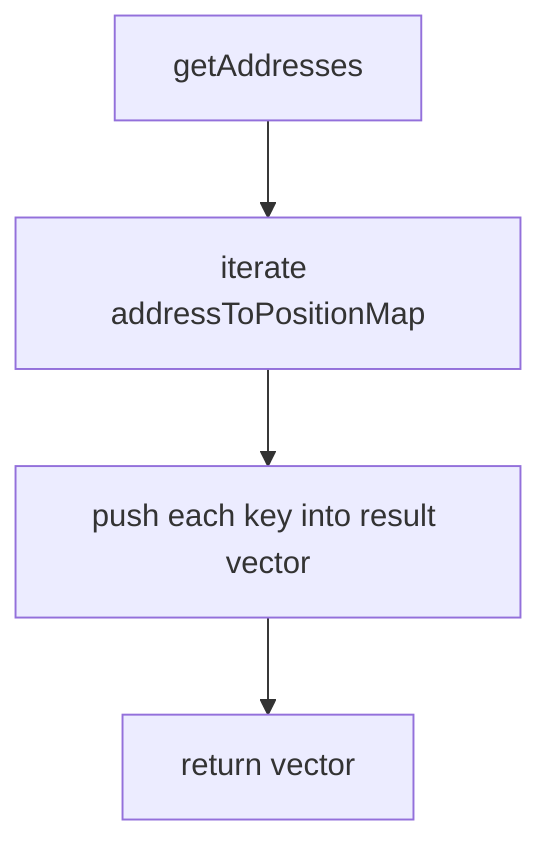
```mermaid
flowchart TD
    A[getAddresses] --> B[iterate addressToPositionMap]
    B --> C[push each key into result vector]
    C --> D[return vector]
```

---

#### `hasPosition(address) const → bool`

**Purpose:** Tests whether `address` exists in the neighbour table.  
**Inputs:** `address` — L3Address to check.  
**Called by:** Internally for guard checks.

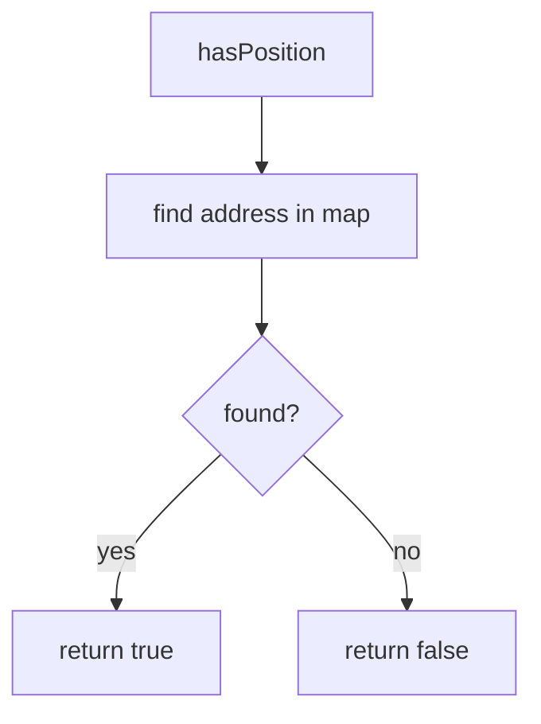
```mermaid
flowchart TD
    A[hasPosition] --> B[find address in map]
    B --> C{found?}
    C -- yes --> D[return true]
    C -- no --> E[return false]
```

---

#### `getPosition(address) const → Coord`

**Purpose:** Returns the last-known position of `address`. Returns `(NaN, NaN, NaN)` if not found.  
**Inputs:** `address` — L3Address.  
**Called by:** `findGreedyRoutingNextHop()` to get each candidate's position.

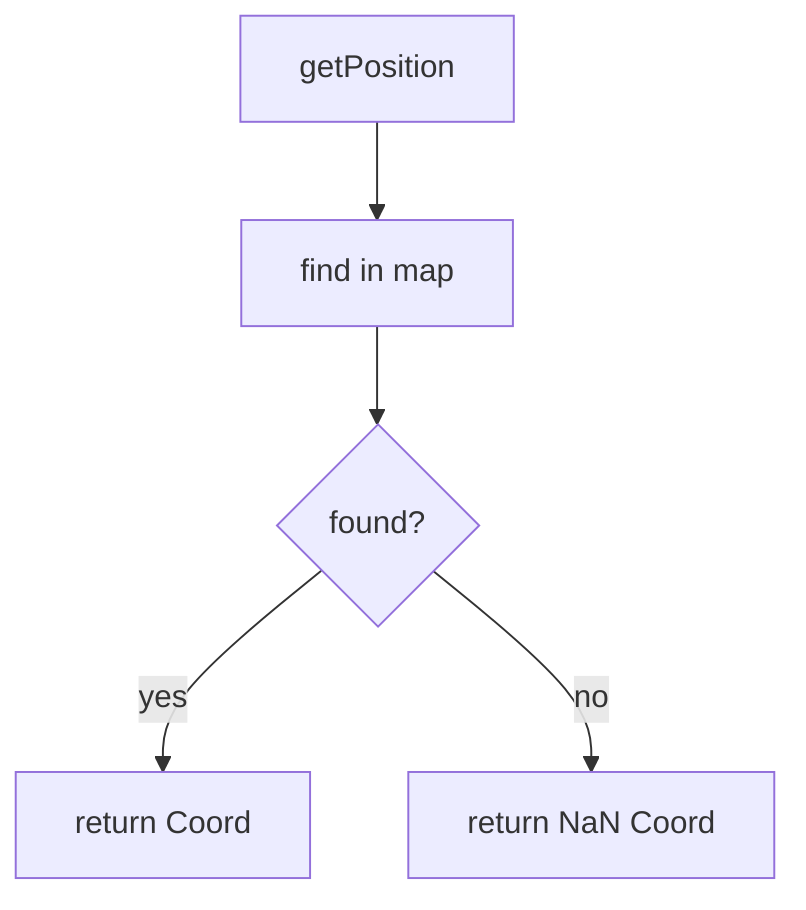
```mermaid
flowchart TD
    A[getPosition] --> B[find in map]
    B --> C{found?}
    C -- yes --> D[return Coord]
    C -- no --> E[return NaN Coord]
```

---

#### `setPosition(address, coord)`

**Purpose:** Inserts or updates a neighbour entry with current simulation time as timestamp.  
**Inputs:** `address`, `coord` (current position).  
**Called by:** `processBeacon()` for every legitimate beacon received.

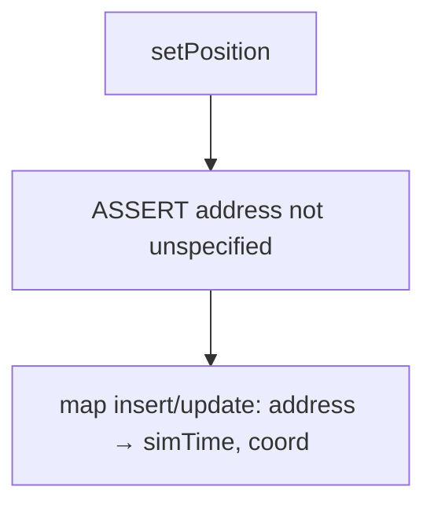
```mermaid
flowchart TD
    A[setPosition] --> B[ASSERT address not unspecified]
    B --> C[map insert/update: address → simTime, coord]
```

---

#### `removePosition(address)`

**Purpose:** Removes a single neighbour entry.  
**Inputs:** `address`.  
**Called by:** Not called directly in current code (available for future use).

---

#### `removeOldPositions(timestamp)`

**Purpose:** Purges entries whose timestamp ≤ `timestamp` (i.e., older than the validity window).  
**Inputs:** `timestamp = simTime() − neighborValidityInterval`.  
**Called by:** `purgeNeighbors()`.

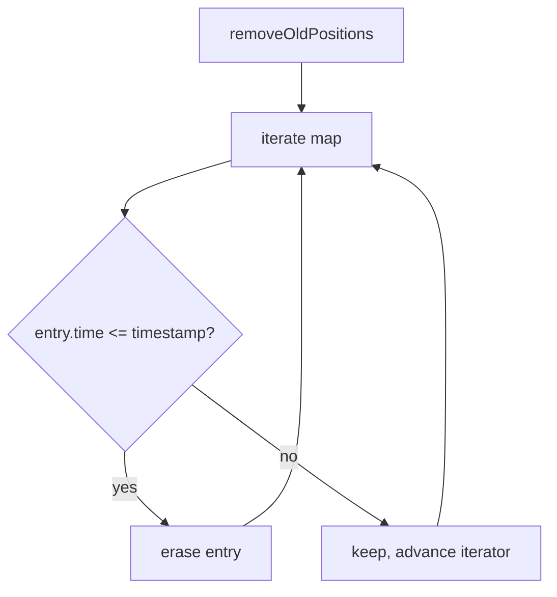
```mermaid
flowchart TD
    A[removeOldPositions] --> B[iterate map]
    B --> C{entry.time <= timestamp?}
    C -- yes --> D[erase entry]
    C -- no --> E[keep, advance iterator]
    D --> B
    E --> B
```

---

#### `clear()`

**Purpose:** Empties both the neighbour table and the eavesdropper table.  
**Called by:** `handleStopOperation()`, `handleCrashOperation()`, and at simulation start in `initialize()`.

---

#### `getOldestPosition() const → simtime_t`

**Purpose:** Returns the smallest timestamp among all neighbours (or `SimTime::getMaxTime()` if empty). Used to schedule the next purge timer.  
**Called by:** `getNextNeighborExpiration()`.

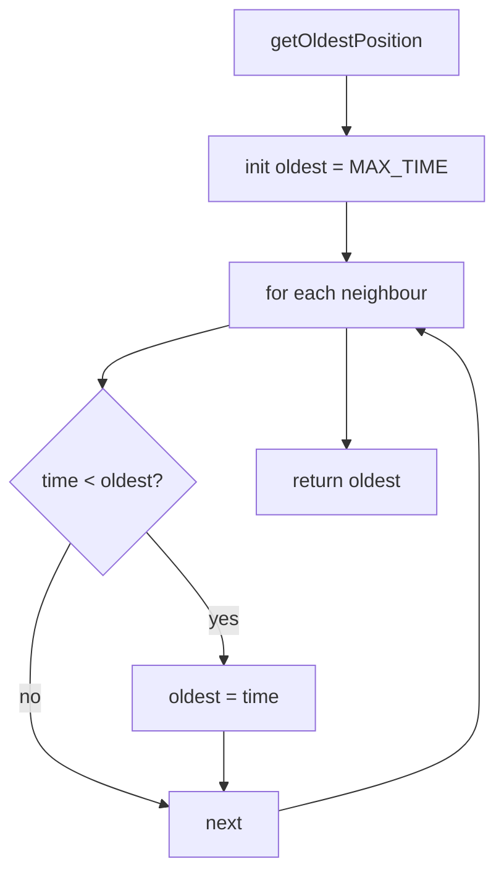
```mermaid
flowchart TD
    A[getOldestPosition] --> B[init oldest = MAX_TIME]
    B --> C[for each neighbour]
    C --> D{time < oldest?}
    D -- yes --> E[oldest = time]
    D -- no --> F[next]
    E --> F
    F --> C
    C --> G[return oldest]
```

---

### Methods — Eavesdropper Table (PLS Addition)

#### `addEavesdropper(address, position)`

**Purpose:** Inserts or refreshes an eavesdropper entry.  
**Inputs:** `address`, `position`.  
**Called by:** `processBeacon()` in both `neighborPositionTable` and `globalPositionTable` when `isEavesdropper = true`.

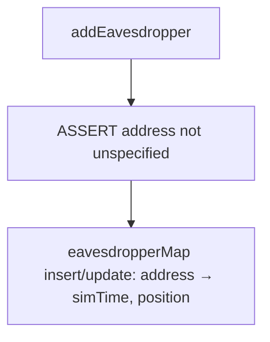
```mermaid
flowchart TD
    A[addEavesdropper] --> B[ASSERT address not unspecified]
    B --> C[eavesdropperMap insert/update: address → simTime, position]
```

---

#### `isEavesdropper(address) const → bool`

**Purpose:** Checks if a given address is registered as an eavesdropper.  
**Inputs:** `address`.  
**Called by:** Available; currently not called in routing path.

---

#### `getEavesdropperPosition(address) const → Coord`

**Purpose:** Returns the position of a known eavesdropper, or `(NaN, NaN, NaN)` if not found.  
**Called by:** `calculateSecrecyCapacity()` for each eavesdropper in the global table.

---

#### `getEavesdropperAddresses() const → vector<L3Address>`

**Purpose:** Returns all known eavesdropper addresses.  
**Called by:** `calculateSecrecyCapacity()` and `finish()`.

---

#### `removeOldEavesdroppers(timestamp)`

**Purpose:** Purges eavesdropper entries older than `timestamp`.  
**Called by:** `purgeNeighbors()`.

---

#### `clearEavesdroppers()`

**Purpose:** Removes all eavesdropper entries.  
**Called by:** `clear()`.

---

#### `operator<<(ostream, table)`

**Purpose:** Debugging stream output showing both neighbour and eavesdropper tables.  
**Called by:** OMNeT++ `WATCH()` macro in `initialize()`.

---

## 5. File: `UFRPLS.msg`

### Role & Purpose

OMNeT++ message definition file processed by `opp_msgc` to auto-generate `UFRPLS_m.h` / `UFRPLS_m.cc`. Defines the two packet structures exchanged in the protocol.

---

### Message: `UFRPLSBeacon` (extends `FieldsChunk`)

Periodically broadcast by every VANET node to announce its network address and position.

| Field | Type | Default | Description |
|---|---|---|---|
| `address` | `L3Address` | — | Sender's network address |
| `position` | `Coord` | — | Sender's current geographic position |
| `eavesdropper` | `bool` | `false` | PLS flag: `true` = this node is an eavesdropper |

The `eavesdropper` flag is the key PLS extension: when set, receivers record the sender in their eavesdropper table rather than their neighbour table.

---

### Message: `UFRPLSOption` (extends `TlvOptionBase`)

Routing header option attached to each data packet, carrying per-route state.

| Field | Type | Default | Description |
|---|---|---|---|
| `routingMode` | `UFRPLSForwardingMode` | -1 | Must be `UFRPLS_GREEDY_ROUTING (1)` |
| `destinationPosition` | `Coord` | — | Geographic position of the destination |
| `routeMinCS` | `double` | `1e300` | Minimum CS observed along the route so far |

`routeMinCS` accumulates the worst-case secrecy capacity across all hops, implementing Chai's primary evaluation metric.

---

### Enum: `UFRPLSForwardingMode`

```
UFRPLS_GREEDY_ROUTING = 1
```

Perimeter mode was intentionally removed; only greedy mode is supported.

---

## 6. File: `UFRPLS.ned`

### Role & Purpose

OMNeT++ Network Description file that defines the `UFRPLS` simple module's interface: parameters, gates, and statistic declarations.

### Parameters

| Parameter | Type | Default | Description |
|---|---|---|---|
| `interfaceTableModule` | string | — | Path to InterfaceTable submodule |
| `routingTableModule` | string | `^.ipv4.routingTable` | Path to RoutingTable submodule |
| `networkProtocolModule` | string | `^.ipv4.ip` | Path to IP module (for netfilter hooks) |
| `outputInterface` | string | `wlan0` | Output interface name |
| `interfaces` | string | `*` | Interface name pattern for beaconing |
| `beaconInterval` | double (s) | `10s` | Beacon transmission period |
| `maxJitter` | double (s) | `0.5 * beaconInterval` | Max random jitter on beacon timer |
| `neighborValidityInterval` | double (s) | `4.5 * beaconInterval` | Neighbour entry TTL |
| `positionByteLength` | int (B) | `8B` | Byte length of a position field |
| `alpha` | double | `0.5` | CS weight in utility function |
| `transmitPower` | double | `0.01` | Pt in watts |
| `noisePower` | double | `3.981e-21` | σ² in watts |
| `wavelength` | double | `0.05085` | λ in meters |
| `initialWaitWindow` | double (s) | `0.000130` | tw₁ = 130 µs |
| `waitThreshold` | double (s) | `0.065` | T = 65 ms |
| `isEavesdropper` | bool | `false` | Mark this node as an eavesdropper in `.ini` |
| `displayBubbles` | bool | `false` | Show GUI bubbles during routing |

### Gates

| Gate | Direction | Description |
|---|---|---|
| `socketIn` | input | Receives packets from the network layer |
| `socketOut` | output | Sends packets to the network layer |

### Statistics (Signals → `.sca`/`.vec`)

| Signal | Record | Unit | Description |
|---|---|---|---|
| `secrecyCapacity` | `stats, vector` | bps/Hz | CS value at each greedy hop |
| `minSecrecyCapacityPerPacket` | `stats, vector` | bps/Hz | Min CS per delivered packet |
| `endToEndDelay` | `mean, vector` | s | Packet creation-to-delivery delay |

---

## 7. File: `UFRPLS.h`

### Role & Purpose

Declares the `UFRPLS` class, which inherits from:
- `RoutingProtocolBase` — INET lifecycle and message handling base
- `cListener` — to receive OMNeT++ signals (link break)
- `NetfilterBase::HookBase` — to intercept IP packets via netfilter hooks

### Private Member Variables

| Variable | Type | Description |
|---|---|---|
| `interfaces` | `const char*` | Interface name pattern |
| `beaconInterval` | `double` | Beacon period (s) |
| `maxJitter` | `simtime_t` | Max jitter on beacon timer |
| `neighborValidityInterval` | `simtime_t` | Neighbour entry TTL |
| `displayBubbles` | `bool` | GUI bubble flag |
| `host` | `cModule*` | Containing host module |
| `mobility` | `IMobility*` | Mobility module interface |
| `addressType` | `IL3AddressType*` | Address type utility |
| `interfaceTable` | `IInterfaceTable*` | Interface table module |
| `outputInterface` | `const char*` | Output interface name |
| `routingTable` | `IRoutingTable*` | Routing table module |
| `networkProtocol` | `INetfilter*` | IP netfilter interface |
| `globalPositionTable` | `UFRPLSPositionTable` (static) | Simulation-wide position/eavesdropper registry |
| `positionByteLength` | `int` | Bytes per position field |
| `beaconTimer` | `cMessage*` | Self-message for beacon scheduling |
| `purgeNeighborsTimer` | `cMessage*` | Self-message for table purge scheduling |
| `neighborPositionTable` | `UFRPLSPositionTable` | Per-node neighbour/eavesdropper table |
| `waitingDatagrams` | `map<Packet*, WaitingState>` | Per-datagram waiting state |
| `alpha` | `double` | CS weight (α) |
| `beta` | `double` | Distance weight (β = 1 − α) |
| `transmitPower` | `double` | Pt (W) |
| `noisePower` | `double` | σ² (W) |
| `wavelength` | `double` | λ (m) |
| `initialWaitWindow` | `double` | tw₁ (s) |
| `waitThreshold` | `double` | T (s) |
| `totalHops` | `int` | Counter: total greedy hops forwarded |
| `secureHops` | `int` | Counter: hops with CS > 0 |
| `csSignal` | `simsignal_t` | OMNeT++ signal handle for CS |
| `minCsPerPktSignal` | `simsignal_t` | OMNeT++ signal handle for min CS per packet |
| `delaySignal` | `simsignal_t` | OMNeT++ signal handle for E2E delay |

### Nested Struct: `WaitingState`

```cpp
struct WaitingState {
    double currentWindow = 0.0;  // current backoff window tw (s)
    double totalWaited   = 0.0;  // accumulated waiting time (s)
};
```

Tracks exponential-backoff state per queued datagram for Algorithm 2.

---

## 8. File: `UFRPLS.cc` — Function-by-Function Analysis

### Static Constant

```cpp
static constexpr double COMM_RANGE_M = 200.0;
```
Communication range constraint from Chai Table 2. Neighbours farther than 200 m are excluded from next-hop selection.

---

### `UFRPLS()` — Constructor

**Purpose:** Default constructor; no-op body.  
**Called by:** OMNeT++ module instantiation.

---

### `~UFRPLS()` — Destructor

**Purpose:** Cancels and deletes beacon and purge timers to prevent memory leaks.

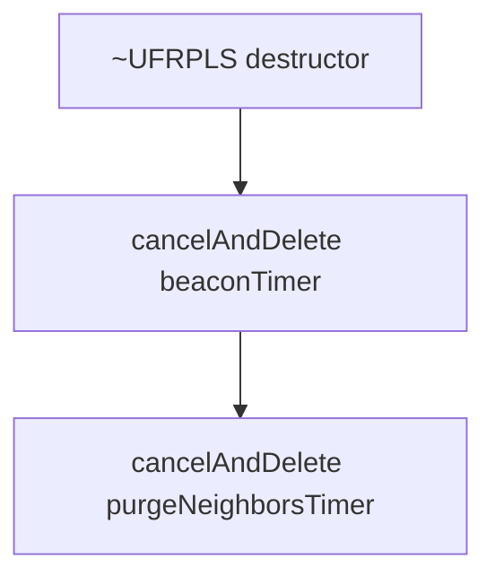
```mermaid
flowchart TD
    A[~UFRPLS destructor] --> B[cancelAndDelete beaconTimer]
    B --> C[cancelAndDelete purgeNeighborsTimer]
```

---

### `initialize(int stage)`

**Purpose:** Two-stage OMNeT++ initialisation.

**Stage `INITSTAGE_LOCAL`:**
- Reads all NED parameters into member variables
- Resolves module pointers (host, mobility, interfaceTable, routingTable, networkProtocol)
- Allocates beacon and purge timers
- Initialises PLS counters and registers OMNeT++ statistic signals
- Clears `globalPositionTable`

**Stage `INITSTAGE_ROUTING_PROTOCOLS`:**
- Registers MANET protocol with service/protocol layer
- Subscribes to `linkBrokenSignal`
- Registers netfilter hook at priority 0
- Enables `WATCH` on `neighborPositionTable` for GUI inspection

**Inputs:** `stage` — integer init stage index.  
**Called by:** OMNeT++ framework.

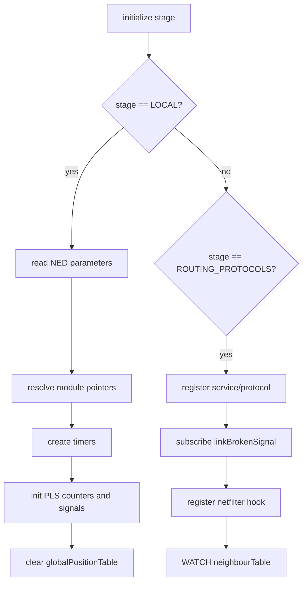
```mermaid
flowchart TD
    A[initialize stage] --> B{stage == LOCAL?}
    B -- yes --> C[read NED parameters]
    C --> D[resolve module pointers]
    D --> E[create timers]
    E --> F[init PLS counters and signals]
    F --> G[clear globalPositionTable]
    B -- no --> H{stage == ROUTING_PROTOCOLS?}
    H -- yes --> I[register service/protocol]
    I --> J[subscribe linkBrokenSignal]
    J --> K[register netfilter hook]
    K --> L[WATCH neighbourTable]
```

---

### `handleMessageWhenUp(cMessage *message)`

**Purpose:** Entry point for all messages when the module is in running state.  
**Dispatches:** Self-messages → `processSelfMessage()`, external messages → `processMessage()`.

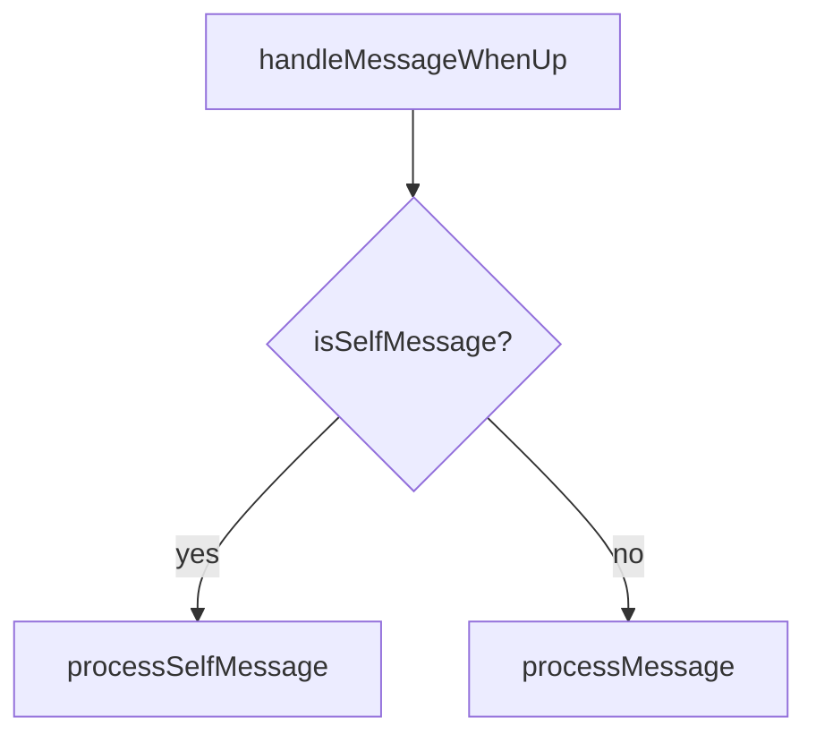
```mermaid
flowchart TD
    A[handleMessageWhenUp] --> B{isSelfMessage?}
    B -- yes --> C[processSelfMessage]
    B -- no --> D[processMessage]
```

---

### `processSelfMessage(cMessage *message)`

**Purpose:** Identifies and dispatches self-messages by pointer comparison or context pointer.

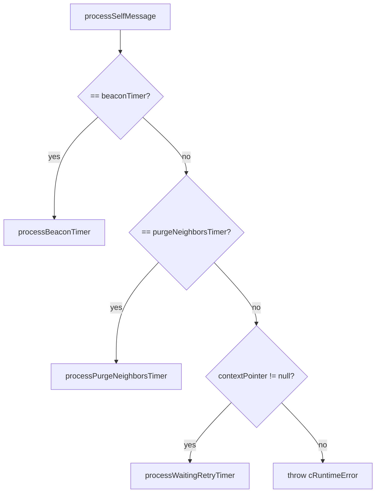
```mermaid
flowchart TD
    A[processSelfMessage] --> B{== beaconTimer?}
    B -- yes --> C[processBeaconTimer]
    B -- no --> D{== purgeNeighborsTimer?}
    D -- yes --> E[processPurgeNeighborsTimer]
    D -- no --> F{contextPointer != null?}
    F -- yes --> G[processWaitingRetryTimer]
    F -- no --> H[throw cRuntimeError]
```

---

### `processWaitingRetryTimer(cMessage *message)`

**Purpose:** Handles expiry of an Algorithm 2 retry timer. Retrieves the queued datagram from the message's context pointer and reinjects it into the network layer.

**Inputs:** `message` — the expired waiting timer; its `contextPointer` holds the `Packet*`.

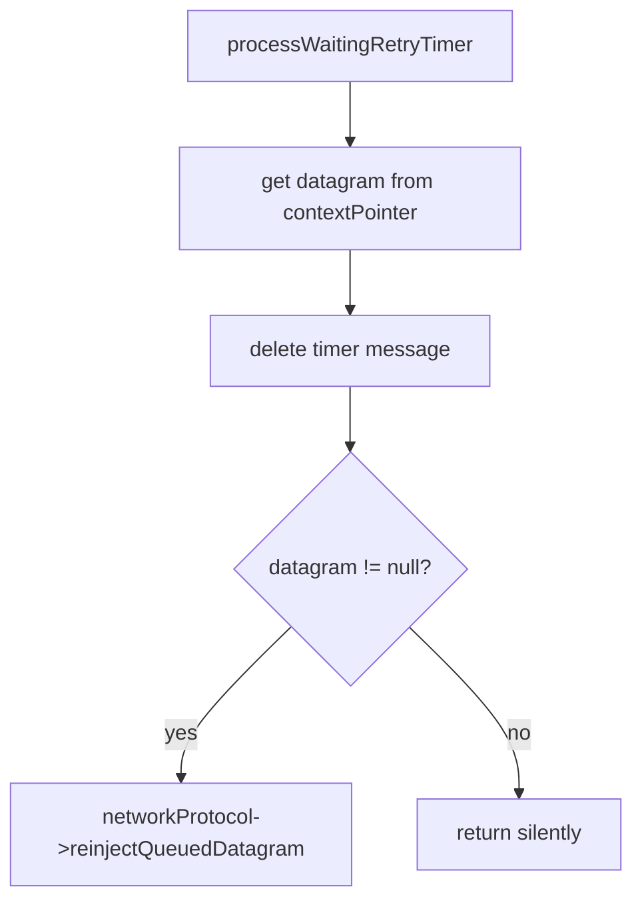
```mermaid
flowchart TD
    A[processWaitingRetryTimer] --> B[get datagram from contextPointer]
    B --> C[delete timer message]
    C --> D{datagram != null?}
    D -- yes --> E[networkProtocol->reinjectQueuedDatagram]
    D -- no --> F[return silently]
```

---

### `processMessage(cMessage *message)`

**Purpose:** Handles external messages. Expects only `Packet*` (UDP beacon) — throws on unknown type.

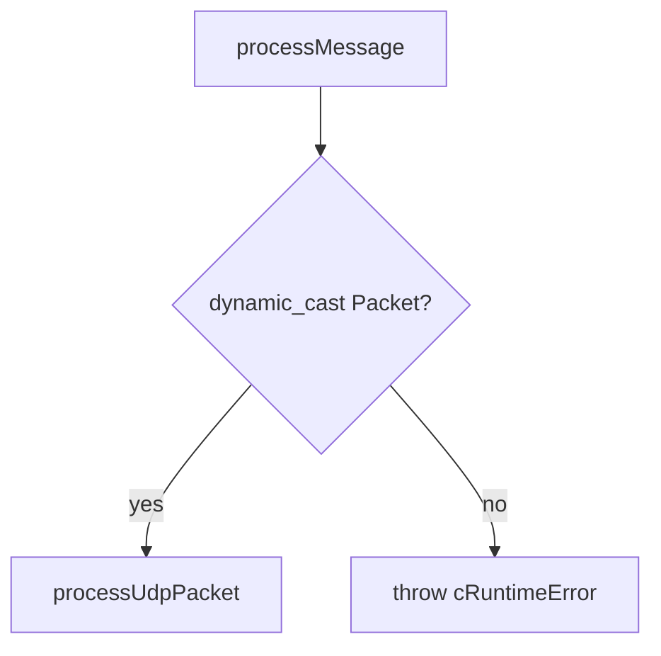
```mermaid
flowchart TD
    A[processMessage] --> B{dynamic_cast Packet?}
    B -- yes --> C[processUdpPacket]
    B -- no --> D[throw cRuntimeError]
```

---

### `scheduleBeaconTimer()`

**Purpose:** Schedules `beaconTimer` to fire at `simTime() + beaconInterval ± jitter`.

**Inputs (implicit):** `beaconInterval`, `maxJitter`.  
**Called by:** `processBeaconTimer()` (self-reschedule) and `handleStartOperation()`.

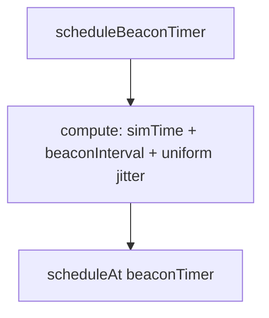
```mermaid
flowchart TD
    A[scheduleBeaconTimer] --> B[compute: simTime + beaconInterval + uniform jitter]
    B --> C[scheduleAt beaconTimer]
```

---

### `processBeaconTimer()`

**Purpose:** Triggered when beacon timer fires. Creates and broadcasts a beacon, updates the global position registry, reschedules beacon and purge timers.

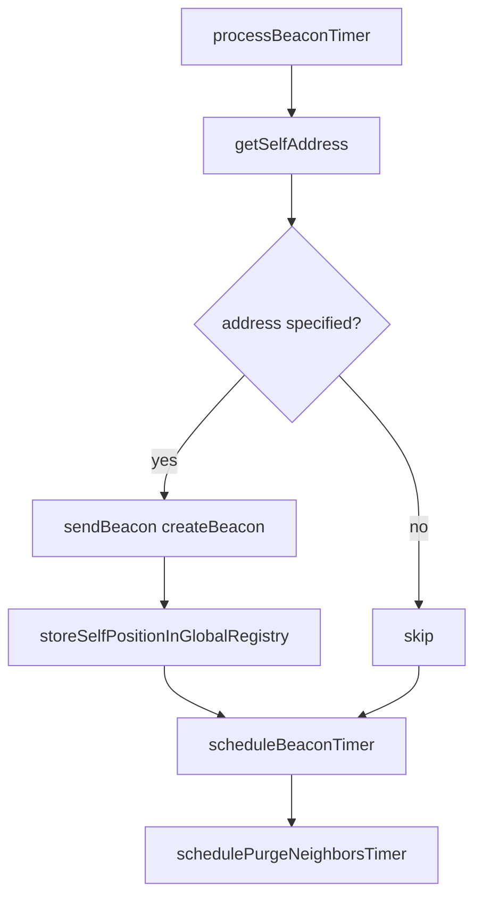
```mermaid
flowchart TD
    A[processBeaconTimer] --> B[getSelfAddress]
    B --> C{address specified?}
    C -- yes --> D[sendBeacon createBeacon]
    D --> E[storeSelfPositionInGlobalRegistry]
    C -- no --> F[skip]
    E --> G[scheduleBeaconTimer]
    F --> G
    G --> H[schedulePurgeNeighborsTimer]
```

---

### `schedulePurgeNeighborsTimer()`

**Purpose:** Schedules or reschedules `purgeNeighborsTimer` to fire at the next neighbour expiration time. Cancels the timer if the neighbour table is empty.

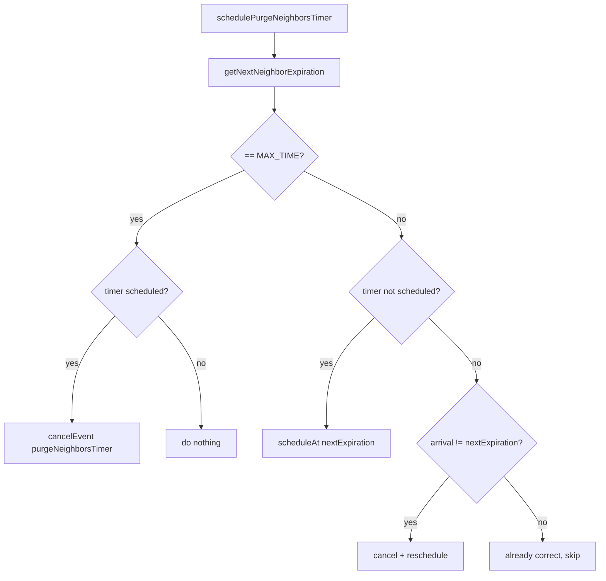
```mermaid
flowchart TD
    A[schedulePurgeNeighborsTimer] --> B[getNextNeighborExpiration]
    B --> C{== MAX_TIME?}
    C -- yes --> D{timer scheduled?}
    D -- yes --> E[cancelEvent purgeNeighborsTimer]
    D -- no --> F[do nothing]
    C -- no --> G{timer not scheduled?}
    G -- yes --> H[scheduleAt nextExpiration]
    G -- no --> I{arrival != nextExpiration?}
    I -- yes --> J[cancel + reschedule]
    I -- no --> K[already correct, skip]
```

---

### `processPurgeNeighborsTimer()`

**Purpose:** Purges stale neighbour/eavesdropper entries and reschedules the purge timer.

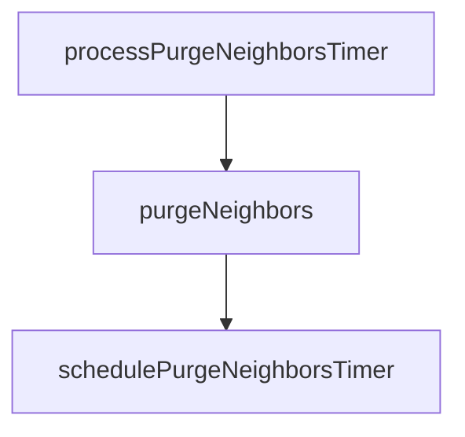
```mermaid
flowchart TD
    A[processPurgeNeighborsTimer] --> B[purgeNeighbors]
    B --> C[schedulePurgeNeighborsTimer]
```

---

### `sendUdpPacket(Packet *packet)`

**Purpose:** Sends a packet out through the `socketOut` gate.  
**Inputs:** `packet` — fully assembled UDP packet.

---

### `processUdpPacket(Packet *packet)`

**Purpose:** Strips the UDP header from an incoming packet and delegates to `processBeacon()`. Then reschedules the purge timer.

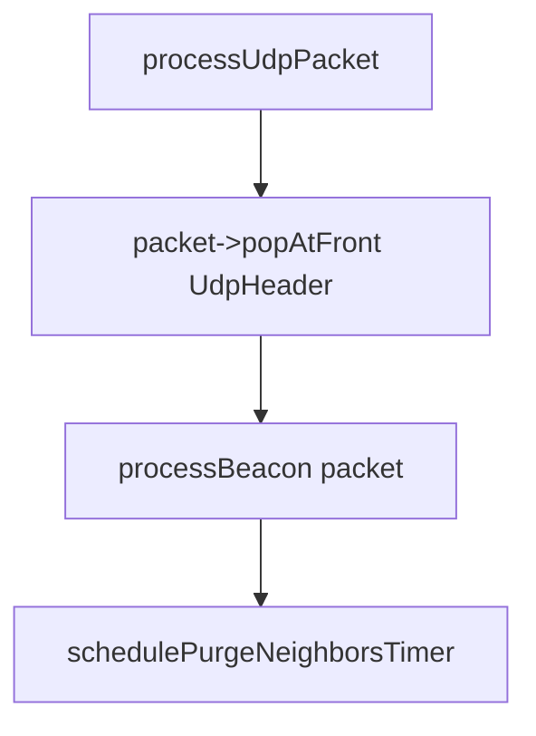
```mermaid
flowchart TD
    A[processUdpPacket] --> B[packet->popAtFront UdpHeader]
    B --> C[processBeacon packet]
    C --> D[schedulePurgeNeighborsTimer]
```

---

### `createBeacon() → Ptr<UFRPLSBeacon>`

**Purpose:** Allocates and fills a `UFRPLSBeacon` chunk with this node's address, position, byte length, and the `isEavesdropper` flag read from the NED parameter.

**Inputs (implicit):** `getSelfAddress()`, `mobility->getCurrentPosition()`, `par("isEavesdropper")`.

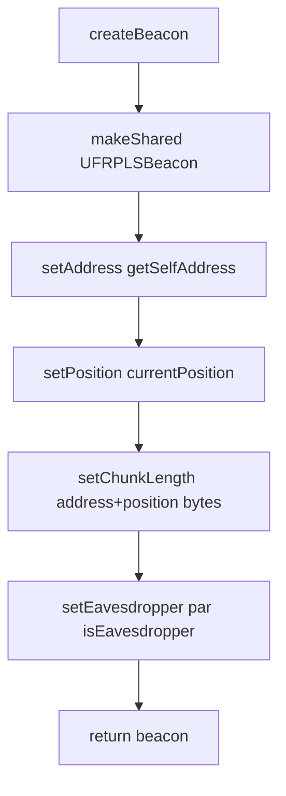
```mermaid
flowchart TD
    A[createBeacon] --> B[makeShared UFRPLSBeacon]
    B --> C[setAddress getSelfAddress]
    C --> D[setPosition currentPosition]
    D --> E[setChunkLength address+position bytes]
    E --> F[setEavesdropper par isEavesdropper]
    F --> G[return beacon]
```

---

### `sendBeacon(const Ptr<UFRPLSBeacon>& beacon)`

**Purpose:** Wraps the beacon in a UDP packet with source/destination port 269, multicast destination address, hop limit 255, and protocol tag for MANET. Calls `sendUdpPacket()`.

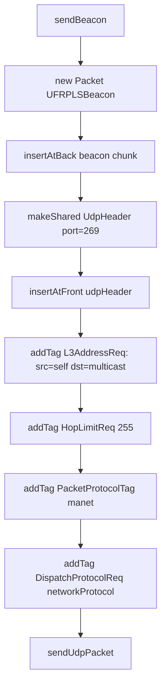
```mermaid
flowchart TD
    A[sendBeacon] --> B[new Packet UFRPLSBeacon]
    B --> C[insertAtBack beacon chunk]
    C --> D[makeShared UdpHeader port=269]
    D --> E[insertAtFront udpHeader]
    E --> F[addTag L3AddressReq: src=self dst=multicast]
    F --> G[addTag HopLimitReq 255]
    G --> H[addTag PacketProtocolTag manet]
    H --> I[addTag DispatchProtocolReq networkProtocol]
    I --> J[sendUdpPacket]
```

---

### `processBeacon(Packet *packet)`

**Purpose:** Processes a received `UFRPLSBeacon`. The key routing decision is:
- If `isEavesdropper == true` → add to **both** `neighborPositionTable` and `globalPositionTable` eavesdropper tables.
- Else → update `neighborPositionTable` legitimate neighbour entry.

Deletes the packet after processing.

**Inputs:** `packet` — received UDP packet containing the beacon.

```mermaid
flowchart TD
    A[processBeacon] --> B[peekAtFront UFRPLSBeacon]
    B --> C[get address and position]
    C --> D{isEavesdropper?}
    D -- yes --> E[neighborPositionTable.addEavesdropper]
    E --> F[globalPositionTable.addEavesdropper]
    F --> G[EV_INFO eavesdropper recorded]
    D -- no --> H[neighborPositionTable.setPosition]
    H --> I[EV_INFO neighbor updated]
    G --> J[delete packet]
    I --> J
```

---

### `createUFRPLSOption(L3Address destination) → UFRPLSOption*`

**Purpose:** Creates a new routing option header for an outgoing data packet. Sets mode to greedy, looks up destination position in the global registry, initialises `routeMinCS = 1e300`.

**Inputs:** `destination` — L3Address of the packet's final destination.

```mermaid
flowchart TD
    A[createUFRPLSOption] --> B[new UFRPLSOption]
    B --> C[setRoutingMode UFRPLS_GREEDY_ROUTING]
    C --> D[setDestinationPosition lookupPositionInGlobalRegistry dst]
    D --> E[setLength computeOptionLength]
    E --> F[return option]
```

---

### `computeOptionLength(UFRPLSOption *option) → int`

**Purpose:** Computes byte length of the routing option: 2 (TL) + 1 (mode) + 8 (position) + 8 (routeMinCS) = 19 bytes.

---

### `configureInterfaces()`

**Purpose:** Joins the MANET multicast group on all interfaces matching the `interfaces` pattern.

```mermaid
flowchart TD
    A[configureInterfaces] --> B[create pattern matcher from interfaces param]
    B --> C[for each interface in table]
    C --> D{isMulticast AND name matches?}
    D -- yes --> E[joinMulticastGroup manetAddress]
    D -- no --> F[skip]
    E --> C
    F --> C
```

---

### `lookupPositionInGlobalRegistry(address) → Coord`

**Purpose:** Retrieves an address's position from the simulation-wide static table.

---

### `storePositionInGlobalRegistry(address, position)`

**Purpose:** Inserts or updates an address in the global table.

---

### `storeSelfPositionInGlobalRegistry()`

**Purpose:** Convenience wrapper that stores this node's own address and current position into the global registry.  
**Called by:** `processBeaconTimer()` and `handleStartOperation()`.

---

### `getHostName() const → string`

**Purpose:** Returns the OMNeT++ full name of the host module (for logging).

---

### `getSelfAddress() const → L3Address`

**Purpose:** Returns this node's L3 address. For IPv6, selects the preferred unicast address from the interface table.

```mermaid
flowchart TD
    A[getSelfAddress] --> B[routingTable->getRouterIdAsGeneric]
    B --> C{IPv6?}
    C -- yes --> D[for each interface]
    D --> E{not loopback?}
    E -- yes --> F[get preferredAddress from Ipv6InterfaceData]
    F --> G[return IPv6 address]
    C -- no --> H[return generic address]
```

---

### `getNextNeighborExpiration() → simtime_t`

**Purpose:** Returns `oldestNeighborTimestamp + neighborValidityInterval`, i.e., when the oldest current neighbour entry will expire.  
**Called by:** `schedulePurgeNeighborsTimer()`.

---

### `purgeNeighbors()`

**Purpose:** Removes both stale neighbour entries and stale eavesdropper entries from `neighborPositionTable` using the validity window `simTime() − neighborValidityInterval`.  
**Called by:** `processPurgeNeighborsTimer()`.

---

### `calculateChannelCapacity(senderPos, receiverPos) → double`

**Purpose:** Implements Equations (2) and (3) from Chai et al. Computes the Shannon capacity of the link between `senderPos` and `receiverPos` using the Free Space Path Loss model.

**Formula:**
```
d   = ||receiverPos − senderPos||  (clamped to ≥ 1.0 m)
|h|² = (λ / (4π × d))²
SNR  = Pt × |h|² / σ²
C    = log₂(1 + SNR)
```

**Inputs:** Two `Coord` positions.  
**Returns:** Channel capacity in bits/s/Hz.

```mermaid
flowchart TD
    A[calculateChannelCapacity] --> B[d = distance between positions]
    B --> C{d < 1.0?}
    C -- yes --> D[d = 1.0 avoid div-by-zero]
    C -- no --> E
    D --> E[pathLoss = wavelength / 4pi*d]
    E --> F[channelGain = pathLoss^2]
    F --> G[SNR = transmitPower * channelGain / noisePower]
    G --> H[return log2 1+SNR]
```

---

### `calculateSecrecyCapacity(senderPos, nextHopPos) → double`

**Purpose:** Implements Equation (4) from Chai et al. Computes the **worst-case** Physical Layer Secrecy Capacity against all known eavesdroppers.

**Formula:**
```
C_ij = calculateChannelCapacity(sender, nextHop)
For each eavesdropper e in globalPositionTable:
    C_ie = calculateChannelCapacity(sender, e_pos)
    CS   = max(C_ij − C_ie, 0)
CS_ij = min(CS over all eavesdroppers)
Return C_ij if no eavesdroppers known
```

**Design Decision:** Uses `globalPositionTable` (not `neighborPositionTable`) to ensure nodes outside the eavesdropper's radio range still compute correct CS values — this is mandated by the Chai et al. assumption that all nodes know eavesdropper positions.

```mermaid
flowchart TD
    A[calculateSecrecyCapacity] --> B[Cij = calculateChannelCapacity sender nextHop]
    B --> C[eavesdroppers = globalPositionTable.getEavesdropperAddresses]
    C --> D{empty?}
    D -- yes --> E[return Cij]
    D -- no --> F[minCS = Cij]
    F --> G[for each eavesdropper e]
    G --> H[ePos = getEavesdropperPosition e]
    H --> I[Cie = calculateChannelCapacity sender ePos]
    I --> J[CS = max Cij-Cie, 0.0]
    J --> K{CS < minCS?}
    K -- yes --> L[minCS = CS]
    K -- no --> M[next]
    L --> M
    M --> G
    G --> N[return minCS]
```

---

### `findNextHop(destination, ufrplsOption) → L3Address`

**Purpose:** Dispatcher for next-hop selection. Ensures routing mode is set to GREEDY and delegates to `findGreedyRoutingNextHop()`. Perimeter mode intentionally removed.

```mermaid
flowchart TD
    A[findNextHop] --> B{routingMode != GREEDY?}
    B -- yes --> C[setRoutingMode GREEDY]
    B -- no --> D
    C --> D[findGreedyRoutingNextHop]
    D --> E[return result]
```

---

### `findGreedyRoutingNextHop(destination, ufrplsOption) → L3Address`

**Purpose:** Core next-hop selection algorithm. Implements Chai Algorithm 1 + Equations (1), (4), (5):

1. Get self position from mobility.
2. Iterate all neighbours in `neighborPositionTable`.
3. Filter by communication range R = 200 m.
4. Compute CS via `calculateSecrecyCapacity()`.
5. Skip candidates with `CS ≤ EPSILON`.
6. Compute utility `ε = CS^α × d^β`.
7. Track best (highest utility) candidate.
8. Emit `csSignal` and update `routeMinCS`.

**Returns:** Best next-hop address, or unspecified (L3Address()) if:
- No neighbour within range, OR
- No neighbour with CS > 0

```mermaid
flowchart TD
    A[findGreedyRoutingNextHop] --> B[selfPosition = mobility->getCurrentPosition]
    B --> C[init bestAddr=unspec, bestUtility=-1, foundAny=false, foundSecure=false]
    C --> D[for each neighborAddress in neighborPositionTable]
    D --> E[neighborPos = getPosition]
    E --> F[hopDist = distance selfPos-neighborPos]
    F --> G{hopDist > 200m?}
    G -- yes --> H[skip, next neighbor]
    G -- no --> I[foundAny = true]
    I --> J[CS = calculateSecrecyCapacity selfPos neighborPos]
    J --> K{CS <= EPSILON?}
    K -- yes --> H
    K -- no --> L[foundSecure = true]
    L --> M[utility = CS^alpha * hopDist^beta]
    M --> N{utility > bestUtility?}
    N -- yes --> O[bestUtility=utility, bestCS=CS, bestAddr=neighbor]
    N -- no --> H
    O --> H
    H --> D
    D --> P{foundAny?}
    P -- no --> Q[EV_WARN no neighbor in range, return unspecified]
    P -- yes --> R{foundSecure?}
    R -- no --> S[EV_INFO no secure neighbor, return unspecified]
    R -- yes --> T[totalHops++ secureHops++]
    T --> U[emit csSignal bestCS]
    U --> V{bestCS < routeMinCS?}
    V -- yes --> W[setRouteMinCS bestCS]
    V -- no --> X
    W --> X[return bestAddr]
```

---

### `routeDatagram(Packet *datagram, UFRPLSOption *ufrplsOption) → Result`

**Purpose:** Top-level routing function. Drops datagram if this node is an eavesdropper. Calls `findNextHop()`. If no hop found, calls `queueForWaiting()`. If hop found, clears waiting state and attaches next-hop tag.

```mermaid
flowchart TD
    A[routeDatagram] --> B{isEavesdropper?}
    B -- yes --> C[return DROP]
    B -- no --> D[get src+dst from network header]
    D --> E[nextHop = findNextHop destination option]
    E --> F{nextHop unspecified?}
    F -- yes --> G[queueForWaiting datagram]
    G --> H{result == QUEUE?}
    H -- yes --> I[bubble Waiting for secure hop, return QUEUE]
    H -- no --> J[bubble threshold exceeded, return QUEUE]
    F -- no --> K[clearWaitingState datagram]
    K --> L[addTag NextHopAddressReq nextHop]
    L --> M[addTag InterfaceReq outputInterface]
    M --> N[return ACCEPT]
```

---

### `queueForWaiting(Packet *datagram) → Result`

**Purpose:** Implements Algorithm 2 exponential-backoff waiting. Initialises waiting state for new datagrams. Doubles the current window after each retry. Schedules a `WaitingRetryTimer` self-message. Returns `QUEUE`.

**Algorithm 2 logic:**
```
if state.currentWindow == 0:  init tw = tw₁
if totalWaited + tw > T:       clamp tw to remaining budget (or reset to tw₁)
schedule retry in tw seconds
totalWaited += tw
currentWindow *= 2  (exponential backoff)
```

```mermaid
flowchart TD
    A[queueForWaiting] --> B[get or create WaitingState for datagram]
    B --> C{currentWindow == 0?}
    C -- yes --> D[init window=tw1, totalWaited=0]
    C -- no --> E
    D --> E{totalWaited+window > threshold T?}
    E -- yes --> F[clamp window to remaining budget]
    F --> G{window <= 0?}
    G -- yes --> H[reset window to tw1]
    G -- no --> I
    E -- no --> I
    H --> I[delay = currentWindow]
    I --> J[totalWaited += delay]
    J --> K[currentWindow *= 2]
    K --> L[create WaitingRetryTimer with datagram as context]
    L --> M[scheduleAt simTime+delay]
    M --> N[return QUEUE]
```

---

### `clearWaitingState(const Packet *datagram)`

**Purpose:** Removes the waiting state entry for a datagram once it is successfully routed.

---

### `setUFRPLSOptionOnNetworkDatagram(packet, networkHeader, option)`

**Purpose:** Attaches the `UFRPLSOption` into the correct protocol header based on the network layer type:
- IPv4: `Ipv4Header` options field
- IPv6: `Ipv6HopByHopOptionsHeader` TLV
- NextHop: `NextHopForwardingHeader` TLV options

```mermaid
flowchart TD
    A[setUFRPLSOptionOnNetworkDatagram] --> B[trimFront packet]
    B --> C{IPv4 header?}
    C -- yes --> D[remove IPv4 header, addOption, update lengths, reinsert]
    C -- no --> E{IPv6 header?}
    E -- yes --> F[remove IPv6 header, find/create HopByHop ext, insert TLV, update lengths, reinsert]
    E -- no --> G{NextHop header?}
    G -- yes --> H[remove NextHop header, insert TLV, update length, reinsert]
    G -- no --> I[no-op]
```

---

### `findUFRPLSOptionInNetworkDatagram(networkHeader) → const UFRPLSOption*`

**Purpose:** Searches the network header for an existing `UFRPLSOption` (read-only). Returns `nullptr` if not found.

---

### `findUFRPLSOptionInNetworkDatagramForUpdate(networkHeader) → UFRPLSOption*`

**Purpose:** Same as above but returns a mutable pointer for in-place modification.

---

### `getUFRPLSOptionFromNetworkDatagram(networkHeader) → const UFRPLSOption*`

**Purpose:** Wrapper that throws `cRuntimeError` if option not found (non-nullable version).

---

### `getUFRPLSOptionFromNetworkDatagramForUpdate(networkHeader) → UFRPLSOption*`

**Purpose:** Mutable wrapper with error on not-found.

---

### `datagramPreRoutingHook(Packet *datagram) → Result`

**Purpose:** Netfilter hook invoked for every datagram arriving at this node before routing decision.
- Accepts multicast/broadcast/local destinations immediately.
- For transit packets: extracts the `UFRPLSOption` and calls `routeDatagram()`.

```mermaid
flowchart TD
    A[datagramPreRoutingHook] --> B[get network header]
    B --> C[get destination address]
    C --> D{multicast OR broadcast OR local?}
    D -- yes --> E[return ACCEPT]
    D -- no --> F[getUFRPLSOptionFromNetworkDatagram]
    F --> G[routeDatagram datagram option]
    G --> H[return result]
```

---

### `datagramForwardHook(Packet *datagram) → Result`

**Purpose:** Not used — always returns `ACCEPT`.

---

### `datagramPostRoutingHook(Packet *datagram) → Result`

**Purpose:** Not used — always returns `ACCEPT`.

---

### `datagramLocalInHook(Packet *datagram) → Result`

**Purpose:** Called when a datagram is delivered to a local application (packet reached its destination). Emits:
- `minCsPerPktSignal` with `routeMinCS` (Chai's primary metric)
- `delaySignal` with `simTime() − datagram->getCreationTime()`

Only emits if `routeMinCS < 1e300` (i.e., packet has traversed at least one UFRPLS-routed hop).

```mermaid
flowchart TD
    A[datagramLocalInHook] --> B[get network header]
    B --> C[findUFRPLSOptionInNetworkDatagram]
    C --> D{opt exists AND routeMinCS < 1e300?}
    D -- yes --> E[emit minCsPerPktSignal routeMinCS]
    E --> F[delay = simTime - creationTime]
    F --> G{delay >= 0?}
    G -- yes --> H[emit delaySignal delay]
    D -- no --> I[skip]
    H --> J[return ACCEPT]
    I --> J
```

---

### `datagramLocalOutHook(Packet *packet) → Result`

**Purpose:** Called when a local application generates a new packet. Attaches a fresh `UFRPLSOption` and initiates routing.

```mermaid
flowchart TD
    A[datagramLocalOutHook] --> B[get network header + destination]
    B --> C{multicast OR broadcast OR local?}
    C -- yes --> D[return ACCEPT]
    C -- no --> E[createUFRPLSOption destination]
    E --> F[setUFRPLSOptionOnNetworkDatagram]
    F --> G[routeDatagram packet option]
    G --> H[return result]
```

---

### `handleStartOperation(LifecycleOperation *operation)`

**Purpose:** Called when the simulation starts or the node comes online. Configures interfaces, registers self position globally, starts beacon timer.

```mermaid
flowchart TD
    A[handleStartOperation] --> B[configureInterfaces]
    B --> C[storeSelfPositionInGlobalRegistry]
    C --> D[scheduleBeaconTimer]
```

---

### `handleStopOperation(LifecycleOperation *operation)`

**Purpose:** Called on graceful shutdown. Drops all queued datagrams, clears waiting state, clears neighbour table, cancels timers.

```mermaid
flowchart TD
    A[handleStopOperation] --> B[for each waiting datagram: dropQueuedDatagram]
    B --> C[waitingDatagrams.clear]
    C --> D[neighborPositionTable.clear]
    D --> E[cancelEvent beaconTimer]
    E --> F[cancelEvent purgeNeighborsTimer]
```

---

### `handleCrashOperation(LifecycleOperation *operation)`

**Purpose:** Same as `handleStopOperation()` but for crash events (no graceful teardown).

---

### `finish()`

**Purpose:** Called at simulation end. Records scalar statistics:
- `totalHops` — total greedy forward decisions
- `secureHops` — hops where CS > 0
- `globalEavesdropperCount` — number of known eavesdroppers at sim end
- `secureHopRatio` — `secureHops / totalHops`

Mean/vector statistics for `secrecyCapacity`, `minSecrecyCapacityPerPacket`, and `endToEndDelay` are computed automatically by INET from the registered signals.

```mermaid
flowchart TD
    A[finish] --> B[recordScalar totalHops]
    B --> C[recordScalar secureHops]
    C --> D[recordScalar globalEavesdropperCount]
    D --> E[compute secureRatio = secureHops/totalHops]
    E --> F[recordScalar secureHopRatio]
    F --> G[EV_INFO summary]
```

---

### `receiveSignal(source, signalID, obj, details)`

**Purpose:** Handles OMNeT++ notification signals. Currently handles `linkBrokenSignal` (logs a warning; TODO: remove broken neighbour from table).

---

## 9. Cross-Component Interaction Map

```mermaid
graph TD
    NED[UFRPLS.ned] -->|parameters| CC[UFRPLS.cc]
    MSG[UFRPLS.msg] -->|generates| MH[UFRPLS_m.h]
    MSG -->|generates| MCC[UFRPLS_m.cc]
    DEFS[UFRPLSDefs.h] -->|constants| CC
    PT_H[UFRPLSPositionTable.h] -->|class def| PT_CC[UFRPLSPositionTable.cc]
    PT_CC -->|neighbor table| CC
    MH -->|UFRPLSBeacon UFRPLSOption| CC
    CC -->|beacon RX| PT_CC
    CC -->|hop selection| PT_CC
    CC -->|eavesdropper lookup| PT_CC
    CC -->|netfilter hooks| NL[Network Layer IP]
    CC -->|UDP| MANET[MANET Multicast]

    subgraph Per-Node
        CC
        PT_CC
    end
    subgraph Simulation-Wide
        GLOBAL[globalPositionTable static]
    end
    CC --> GLOBAL
    PT_CC --> GLOBAL
```

---

## 10. Mathematical Foundations

### Utility Function (Eq. 1)

```
ε_ij = CS_ij^α × d_ij^β,   α + β = 1,   default α = β = 0.5
```

Balances security (CS) and geographic progress (d) in a single scalar. Higher α favours security; higher β favours longer hops.

### Channel Capacity (Eq. 2–3)

```
h_ij = λ / (4π × d_ij)          [Free Space Path Loss amplitude]
C_ij = log₂(1 + Pt × h_ij² / σ²)  [Shannon capacity, bits/s/Hz]

Parameters (Table 2):
  Pt = 0.01 W         (10 dBm)
  σ² = 3.981e−21 W   (−174 dBm)
  λ  = 0.05085 m      (5.9 GHz carrier)
```

### Secrecy Capacity (Eq. 4)

```
CS_ij = max(C_ij − C_ie, 0)   [vs. single eavesdropper e]
CS_ij = min over all e { max(C_ij − C_ie, 0) }   [worst-case multi-eavesdropper]
```

A positive CS means the legitimate link is physically more capable than the eavesdropper link; information-theoretic secrecy is achievable.

### Algorithm 2: Exponential Backoff Waiting

```
tw₁ = 130 µs   (initial window)
T   = 65 ms    (total threshold)

On each retry:
  if totalWaited + tw > T: clamp tw
  wait tw seconds
  totalWaited += tw
  tw *= 2
```

---

## 11. Statistics & Observability

| Statistic | Signal | Type | Description |
|---|---|---|---|
| `secrecyCapacity` | `csSignal` | vector/stats | CS value for each greedy hop |
| `minSecrecyCapacityPerPacket` | `minCsPerPktSignal` | vector/stats | Worst hop CS per delivered packet |
| `endToEndDelay` | `delaySignal` | mean/vector | Creation-to-delivery delay (s) |
| `totalHops` | scalar | scalar | Total forwarding decisions |
| `secureHops` | scalar | scalar | Decisions where CS > 0 |
| `secureHopRatio` | derived scalar | scalar | secureHops / totalHops |
| `globalEavesdropperCount` | scalar | scalar | Number of eavesdroppers at sim end |

---

*Report generated: 2026-07-01 — EL-GHOUCHMA DRISS / UFRPLS Protocol Analysis*
